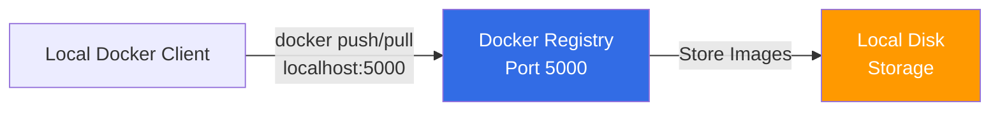
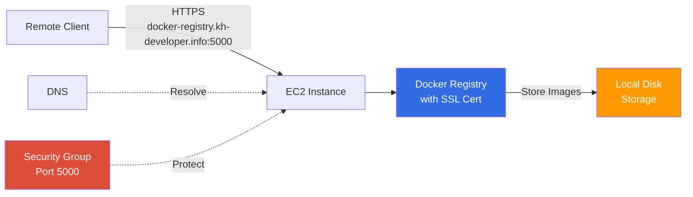
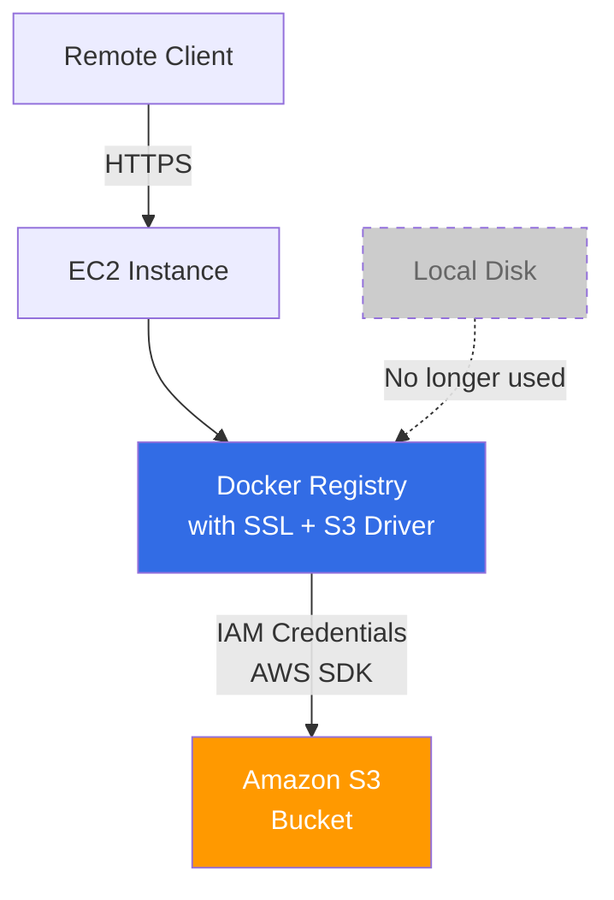
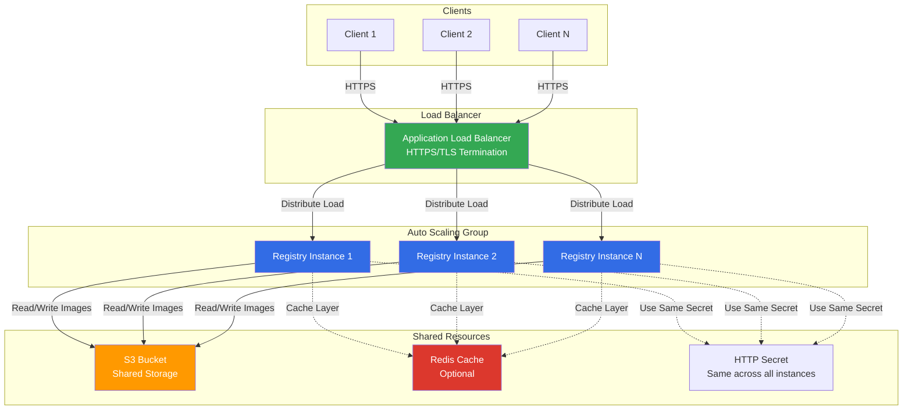
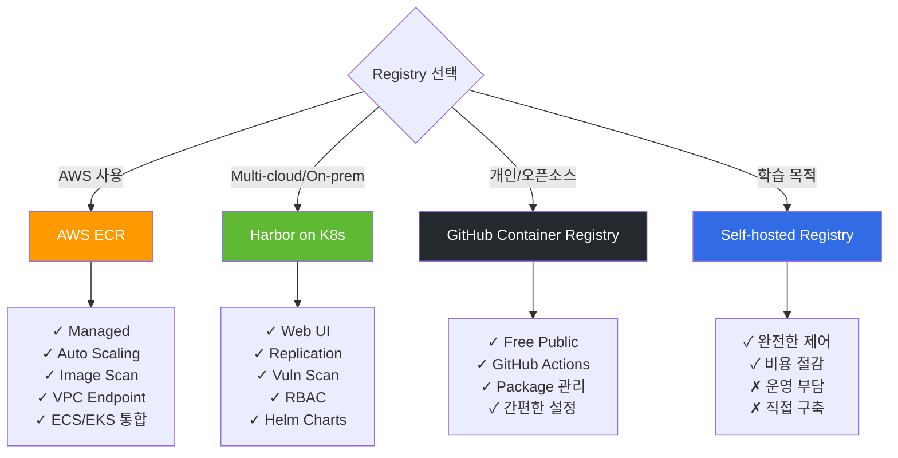

## Summary
---
Docker hub에 private image를 올리는 것은 제한이 있다.
개인 사용자의 경우 하나의 이미지만 private이 가능하고 organization의 경우에는 비용을 지불해야만 사용이 가능하다.
이러한 제약은 여러 개의 private 이미지를 관리해야 하는 개발 환경에서 큰 불편함으로 다가온다. 따라서 우리만의 private registry 환경을 직접 구축할 필요성이 생긴다.

이 글에서는 EC2에 개인 registry를 구축하고, local 또는 다른 원격 서버에서 접근하는 방법을 단계별로 살펴보겠다. 또한 이미지 저장소로 Amazon S3를 연동하여 확장 가능한 구조를 만들어볼 것이다.

## Docker registry 구축하기
---

먼저 가장 기본적인 형태로 registry를 구축해보자. Docker는 공식 registry 이미지를 제공하므로 복잡한 설정 없이도 쉽게 시작할 수 있다.



docker가 설치되어 있는 EC2에 접근하여 registry 이미지를 pull 해보자. registry는 기본적으로 5000번 포트를 사용한다는 점을 기억하자.

```bash
# registry 이미지를 가져오기
$ docker pull registry
```
 
```bash
# registry를 실행하기
$ docker run -dit --name docker-registry -p 5000:5000 registry
```

## Docker image를 push하기
---

registry를 구축했으니 이제 실제로 이미지를 push해서 동작을 확인해보자. 먼저 localhost에서 테스트를 진행하여 기본 동작을 검증한 후, 원격 접근 설정으로 넘어가는 것이 안전한 접근 방법이다.

이미지를 push하기 전에 tagging 규칙을 이해해야 한다. [도커허브](https://hub.docker.com)를 사용할 때는 `<계정아이디>/registry:latest` 처럼 tag명에 내 아이디가 들어가는 모양이었다. 하지만 private registry를 사용할 때는 `<계정아이디>` 부분에 내 registry의 URL 주소를 사용하여야 한다. 이는 Docker가 이미지를 어느 registry로 push할지 판단하는 기준이 되기 때문이다.

localhost에서 테스트를 진행할 것이므로 `localhost:5000/hello-world:latest` 이미지를 만들어보자.

```bash
# hello-world 이미지가 없으니 docker hub에서 pull하자.
$ docker pull hello-world

# localhost/hello-world 이미지를 만들어보자.
$ docker tag hello-world localhost:5000/hello-world
```

이미지를 만들었으니 내 registry에 push하자.

```bash
# 이미지 push하기
$ docker push localhost:5000/hello-world

# 이미지 확인하기
$ curl -X GET http://localhost:5000/v2/_catalog
# 출력 {"repositories":["hello-world"]}

# 태그 정보 확인하기
$ curl -X GET http://localhost:5000/v2/hello-world/tags/list
# 출력 {"name":"hello-world","tags":["latest"]}
```

## 원격지에서 Docker image를 push하기
---

localhost에서는 정상적으로 동작하는 것을 확인했다. 하지만 실제 운영 환경에서는 다른 서버들이 이 registry에 접근해야 하므로, 원격 접근을 설정해야 한다.

지금 이미지의 태그명을 보면 `localhost/~` 로 되어 있는 것을 볼 수 있다. 하지만 원격지에서는 특정 도메인 또는 IP로 접근하기 때문에 localhost나 127.0.0.1을 사용할 수 없다. 원격 접근을 위해서는 gabia, godaddy 또는 AWS Route53을 사용하여 DNS를 설정하거나, 직접 IP 주소로 접근하도록 설정하는 두 가지 방법이 있다.

이번에는 가독성과 관리 편의성을 위해 테스트용 도메인 `docker-registry.kh-developer.info`로 DNS를 설정하여 진행하겠다.

gabia > 네임플러스 > 호스트(IP) 추가/관리 페이지에서 docker-registry를 추가하고 내 EC2 IP를 할당한다.


DNS 설정이 완료되었다면, 원격에서 접근하기 위한 사전 작업을 진행하자:
- 로컬 PC에도 docker가 설치되어 있어야 한다.
- registry를 5000번 포트로 생성했으니 5000번으로 접속한다.
- 보안을 위해 EC2의 Security Group에서 Inbound Rule을 5000번 포트로 설정하되, "My IP"를 선택하여 본인만 접근할 수 있도록 제한하자.


```bash
# 현재 이미지 목록 보기.
$ docker images

# 아직 hello-world가 없으므로 docker pull하기
$ docker pull hello-world

# docker-registry.kh-developer.info:5000/hello-world 이미지를 만들어보자.
$ docker tag hello-world docker-registry.kh-developer.info:5000/hello-world

# 이미지가 생성되었는지 확인해보자.
$ docker images

# push 해보자. 실패할 것이다.
$ docker push docker-registry.kh-developer.info:5000/hello-world
```

아래와 같은 메시지가 나오면서 실패할 것이다.

```bash
Get https://docker-registry.kh-developer.info:5000/v1/_ping: http: server gave HTTP response to HTTPS client
```

이 에러는 예상된 결과다. Docker registry는 보안상의 이유로 localhost가 아닌 원격 접근의 경우 HTTPS만 지원한다. HTTP로 통신할 경우 이미지 전송 과정에서 중간자 공격(Man-in-the-Middle Attack)에 취약해지기 때문이다. 따라서 원격지에서 접속하기 위해서는 SSL 인증서를 적용하여 HTTPS를 활성화해야 한다.

SSL 인증서를 발급받고 registry를 재설정해보자. 먼저 현재의 docker registry 컨테이너를 내리자.

```bash
# docker registry 컨테이너 내리기
$ docker stop docker-registry && docker rm docker-registry
```

SSL 인증서는 유료 인증서를 구매할 수도 있지만, 테스트나 내부 용도로는 자체 서명(Self-signed) 인증서로도 충분하다. 프로덕션 환경이라면 Let's Encrypt 같은 무료 인증서나 공인 인증서를 사용하는 것을 권장하지만, 이번 예제에서는 자체 서명 SSL 인증서를 생성하여 진행하겠다.

대부분의 EC2 인스턴스에는 openssl이 기본적으로 설치되어 있다.

```bash
# openssl 버전 확인하기
$ openssl version

# cert.d 폴더에 개인키 생성하기. 비밀번호를 입력하자. 테스트를 위해 개인키 비밀번호는 test로 하겠다.
$ mkdir certs && cd certs && openssl genrsa -des3 -out server.key 2048

# 인증 요청서 생성
$ openssl req -new -key server.key -out server.csr

Country Name (2 letter code) [XX]:KR
State or Province Name (full name) []:Seoul
Locality Name (eg, city) [Default City]:Seongdonggu
Organization Name (eg, company) [Default Company Ltd]:NOVEMBERDE
Organizational Unit Name (eg, section) []:TEST
Common Name (eg, your name or your server\'s hostname) []:docker-registry.kh-developer.info
Email Address []:

# 생성된 파일 확인하기
$ ll

# 개인키에서 패스워드 제거하기
$ cp server.key server.key.origin && openssl rsa -in server.key.origin -out server.key && rm server.key.origin

# 인증서 생성하기. 1년으로 사용하겠다. 2년 3년할 수도 있다. server.crt파일이 생길 것이다.
$ openssl x509 -req -days 730 -in server.csr -signkey server.key -out server.crt
``` 

인증서 발급이 완료되었다. 이제 생성한 인증서를 사용하도록 registry를 다시 가동해보자.

```bash
$ docker run -d -p 5000:5000 --restart=always --name docker-registry \
  -v /home/<username>/certs:/certs \
  -e REGISTRY_HTTP_TLS_CERTIFICATE=/certs/server.crt \
  -e REGISTRY_HTTP_TLS_KEY=/certs/server.key \
  registry
```

SSL 인증서가 적용된 registry가 성공적으로 가동되었다. 이제 구조는 다음과 같이 변경되었다:



다시 로컬에서 push를 시도해보자.

```bash
# 다시 로컬환경으로 돌아와서 push하기
$ docker push docker-registry.kh-developer.info:5000/hello-world

The push refers to a repository [docker-registry.kh-developer.info:5000/hello-world]
Get https://docker-registry.kh-developer.info:5000/v1/_ping: x509: certificate signed by unknown authority
```

또다시 에러가 발생했다. 이번에는 "certificate signed by unknown authority"라는 메시지가 나온다.

이는 우리가 만든 인증서가 자체 서명 인증서이기 때문이다. 공인 인증 기관(CA)이 서명하지 않은 인증서는 Docker 클라이언트가 신뢰하지 않는다. 따라서 현재 사용하는 PC의 Docker가 이 registry를 "insecure registry"(안전하지 않은 레지스트리)로 인식하도록 설정해야 한다.

설정 방법은 운영 체제와 Docker 환경에 따라 다르다:

**Windows 환경**
하단의 상태표시창에서 Docker > Settings > Daemon > Insecure registries에서 `docker-registry.kh-developer.info:5000`을 추가한다.

**Kitematic (Boot2Docker) 사용 시**
아래와 같은 Virtual Box를 더블클릭하면 콘솔 화면이 나타나는데, 여기서 `/var/lib/boot2docker/profile` 파일을 수정해야 한다.

`EXTRA_ARGS`에 `--insecure-registry`를 아래와 같이 추가한다.


추가 후에 Docker를 재시작하자.

---

설정이 완료되었다면 이제 다시 docker push를 해보자. 이번에는 성공적으로 push가 될 것이다.

```bash
# 다시 로컬환경으로 돌아와서 push하기
$ docker push docker-registry.kh-developer.info:5000/hello-world
```


### S3를 저장소로 사용하기
---

현재까지는 Docker 이미지가 EC2 인스턴스의 로컬 디스크에 저장되고 있다. 하지만 이 방식은 몇 가지 문제점이 있다. EC2 인스턴스가 종료되거나 디스크 용량이 부족해지면 이미지를 잃을 수 있고, 여러 registry 인스턴스를 운영할 경우 데이터 동기화가 어렵다.

이러한 문제를 해결하기 위해 AWS S3를 이미지 저장소로 사용할 수 있다. S3를 사용하면 무제한에 가까운 저장 공간을 확보할 수 있고, 데이터의 내구성과 가용성이 보장되며, 여러 registry 인스턴스가 동일한 저장소를 공유할 수 있어 확장성이 뛰어나다.

S3를 사용하기에 앞서 AWS에서 적절한 권한을 가진 IAM 사용자를 생성하도록 하자.

AWS Menu > Security, Identity & Compliance > IAM 에서 user를 생성한다.
username은 docker-registry로 하고, Access type은 Programmatic access로 하자.


---

Permission은 "Attach existing policies directly"로 하여 S3 FullAccess를 선택하자. 보안을 더 강화하고 싶다면 FullAccess 대신 [Docker 공식 문서](https://docs.docker.com/registry/storage-drivers/s3/#s3-permission-scopes)를 참고하여 최소 권한 원칙에 따른 커스텀 Policy를 생성하는 것을 권장한다.

Create를 완료하면 Access Key와 Secret Access Key를 부여받는다. 이 키는 다시 확인할 수 없으므로 안전한 곳에 잘 보관하도록 하자.

---

이제 발급받은 IAM 자격 증명을 사용하여 Docker registry가 S3에 접근할 수 있도록 설정하자. 최종 아키텍처는 다음과 같다:

<div align="center">



</div>

```bash
# 기존의 registry를 내려주고, 새로 올리자.
$ docker stop docker-registry && docker rm docker-registry

# 새로 올리기
$ docker run -d -p 5000:5000 --restart=always --name docker-registry \
  -v /home/docker/certs:/certs \
  -e REGISTRY_HTTP_TLS_CERTIFICATE=/certs/server.crt \
  -e REGISTRY_HTTP_TLS_KEY=/certs/server.key \
  -e REGISTRY_STORAGE=s3 \
  -e REGISTRY_STORAGE_S3_BUCKET=docker-registry.kh-developer \
  -e REGISTRY_STORAGE_S3_ACCESSKEY=ASEFWAF1232REWE \
  -e REGISTRY_STORAGE_S3_SECRETKEY=ASERWER1234WERFASER354SFDSDF1234 \
  -e REGISTRY_STORAGE_S3_REGION=ap-northeast-1 \
  registry

# 다시 로컬환경으로 돌아와서 push 해보기
$ docker push docker-registry.kh-developer.info:5000/hello-world
```

Push가 성공하면 S3 bucket에 가서 확인해보자. 지정한 bucket에 이미지 데이터가 저장되어 있을 것이다.


### Authentication 추가하기
---

여기까지 S3를 이미지 저장소로 사용하는 Docker registry를 구성했다. 하지만 현재 상태로는 누구나 URL만 알면 이미지를 push하거나 pull할 수 있어 보안상 문제가 있다. 프로덕션 환경에서는 반드시 인증 메커니즘을 추가하여 승인된 사용자만 registry에 접근할 수 있도록 해야 한다.

지금부터는 htpasswd 방식의 기본 인증(Basic Authentication)을 추가하여 registry 접근을 제어해보자.

```bash
# ~/auth라는 디렉터리에 testuser를 아이디로 갖고 testpassword를 비밀번호로 갖게 해보자.
$ mkdir auth && docker run --entrypoint htpasswd registry:2 -Bbn testuser testpassword > auth/htpasswd


# docker registry container를 다시 실행해보자.
$ docker run -d -p 5000:5000 --restart=always --name docker-registry \
  -v /home/docker/certs:/certs \
  -e REGISTRY_HTTP_TLS_CERTIFICATE=/certs/server.crt \
  -e REGISTRY_HTTP_TLS_KEY=/certs/server.key \
  -e REGISTRY_STORAGE=s3 \
  -e REGISTRY_STORAGE_S3_BUCKET=docker-registry.kh-developer \
  -e REGISTRY_STORAGE_S3_ACCESSKEY=ASEFWAF1232REWE \
  -e REGISTRY_STORAGE_S3_SECRETKEY=ASERWER1234WERFASER354SFDSDF1234 \
  -e REGISTRY_STORAGE_S3_REGION=ap-northeast-1 \
  -v /home/docker/auth:/auth \
  -e "REGISTRY_AUTH=htpasswd" \
  -e "REGISTRY_AUTH_HTPASSWD_REALM=Registry Realm" \
  -e REGISTRY_AUTH_HTPASSWD_PATH=/auth/htpasswd \
  registry

# 다시 로컬환경으로 돌아와서 docker push를 해보자
$ docker push docker-registry.kh-developer.info:5000/hello-world
98c944e98de8: Preparing
no basic auth credentials
```

예상대로 "no basic auth credentials" 에러가 발생한다. 인증이 활성화되었기 때문에 이제는 로그인 없이 push할 수 없다. `docker login` 명령어로 인증을 진행하자.

```bash
$ docker login docker-registry.kh-developer.info:5000
Username: testuser
Password:
Login Succeeded

# 로그인이 됐다면 다시 push를 해주자
$ docker push docker-registry.kh-developer.info:5000/hello-world
```


### 2018-05-29 추가사항
---

여기까지 직접 Docker registry를 구축하는 과정을 살펴보았다. 하지만 이 접근 방식을 프로덕션 환경에 적용하려면 몇 가지 중요한 질문들이 생긴다.

1. 동시에 수십, 수백 대의 서버가 이미지를 pull/push하는 경우 단일 registry 서버로 감당할 수 있을까? 만약 불가능하다면 어떻게 설계해야 할까?
2. 이러한 인프라를 직접 구축하고 관리하는 대신, 편하게 사용할 수 있는 Managed Service는 없을까?

먼저 첫 번째 질문에 대한 답은 Docker 공식 문서에 잘 나와 있다.

> Load balancing considerations
>
> One may want to use a load balancer to distribute load, terminate TLS or provide high availability. While a full load balancing setup is outside the scope of this document, there are a few considerations that can make the process smoother.
>
> The most important aspect is that a load balanced cluster of registries must share the same resources. For the current version of the registry, this means the following must be the same:
>
> Storage Driver
>
> HTTP Secret
>
> Redis Cache (if configured)
>
> Differences in any of the above cause problems serving requests. As an example, if you’re using the filesystem driver, all registry instances must have access to the same filesystem root, on the same machine. For other drivers, such as S3 or Azure, they should be accessing the same resource and share an identical configuration. The HTTP Secret coordinates uploads, so also must be the same across instances. Configuring different redis instances works (at the time of writing), but is not optimal if the instances are not shared, because more requests are directed to the backend.

[출처: https://docs.docker.com/registry/deploying/#load-balancing-considerations](https://docs.docker.com/registry/deploying/#load-balancing-considerations)

이 내용을 간단하게 요약하면 다음과 같다.

Load balancing을 적용한 registry 클러스터를 구성하려면 웹 애플리케이션 설계와 유사한 접근 방식이 필요하다. 모든 registry 인스턴스는 Storage Driver를 통해 동일한 스토리지(예: S3)에 접근해야 하며, 성능 향상을 위해 Redis를 캐시 레이어로 추가할 수 있다. 또한 이미지 업로드 조정을 위해 모든 인스턴스가 동일한 HTTP Secret을 공유해야 한다.

결국 여러 registry 인스턴스를 Auto Scaling Group처럼 배포하고, 앞단에 Load Balancer를 두고, 뒷단에는 공통 스토리지(S3)를 연결하는 구조로 설계하면 동시에 많은 요청을 감당할 수 있다.



두 번째 질문인 Managed Service에 대해 살펴보자.

**상용 Managed Service**
1. **Docker Hub의 유료 플랜**: Billing plan을 변경하여 여러 개의 private repository를 생성할 수 있다.
2. **AWS ECR (Elastic Container Registry)**: 사용한 저장 공간과 네트워크 비용만 지불하면 되며, AWS 서비스와의 통합이 뛰어나다.
3. **기타**: Google Container Registry(GCR), Azure Container Registry(ACR) 등도 좋은 선택지다.

**비용 최적화 방안**
비용을 최소화하고 싶다면 `docker save`/`docker load` 명령어를 활용하여 이미지를 tar 파일로 압축하고, 이를 artifact로 관리하는 방법도 있다. Git hash를 이용해 versioning하고 S3나 다른 저장소에 tar 파일을 보관하는 방식이다.

**개인적인 권장 사항**
요즘에는 AWS를 기본으로 사용하다 보니 직접 Docker registry를 운영할 일이 거의 없어졌다. 이 글을 처음 작성했을 때와 달리, 이제는 다음과 같은 접근을 권장한다:

1. **가능하면 Managed Service 사용**: 운영 부담을 줄이고 안정성을 확보할 수 있다. AWS ECR이 가장 무난한 선택이다.
2. **비용이 부담된다면**: `docker save`/`load` 방식으로 tar 파일을 artifact 관리 시스템에서 관리한다.
3. **자체 IDC 환경이라면**: 단일 컨테이너로 registry를 운영하지 말고, Kubernetes나 Docker Swarm으로 클러스터를 구성하여 고가용성을 확보한다.

### 2025 업데이트
---

이 글을 작성한 2017년 이후 컨테이너 생태계는 크게 변화했다. 2025년 현재 시점에서 추가로 고려해야 할 사항들을 정리한다.

**컨테이너 이미지 저장소 생태계의 변화**

1. **Docker Hub의 정책 변화**: 2020년부터 Docker Hub가 rate limiting을 도입하면서(익명 사용자는 6시간당 100회, 인증 사용자는 200회), CI/CD 파이프라인에서 pull 제한에 걸리는 경우가 많아졌다. 이로 인해 많은 기업들이 자체 registry나 Managed Service로 전환했다.

2. **AWS ECR의 발전**: ECR은 이제 Public Registry도 지원하며, VPC Endpoint를 통한 private 통신, 이미지 스캔(Trivy 기반), 복제(replication) 기능 등이 추가되어 프로덕션 환경에서 사용하기에 충분히 성숙했다. 특히 ECS, EKS와의 네이티브 통합은 큰 장점이다.

3. **GitHub Container Registry (GHCR)**: GitHub Actions와의 통합이 뛰어나며, public 이미지는 무료로 저장할 수 있다. 오픈소스 프로젝트나 개인 프로젝트에 좋은 선택이다.

4. **Harbor의 성장**: CNCF 졸업 프로젝트인 Harbor는 self-hosted registry 솔루션 중 가장 성숙한 선택지다. 웹 UI, 이미지 복제, 취약점 스캔, Helm Chart 저장소 등 엔터프라이즈급 기능을 제공한다.

**보안 고려사항**

1. **이미지 스캔 필수화**: Trivy, Clair, Snyk 같은 도구로 이미지 취약점을 스캔하는 것이 이제는 기본이 되었다. ECR, Harbor 등은 이를 기본 제공한다.

2. **Cosign과 이미지 서명**: Supply chain 보안을 위해 Sigstore 프로젝트의 Cosign을 활용한 이미지 서명이 점점 보편화되고 있다.

3. **OCI 표준**: Docker 이미지 포맷이 OCI(Open Container Initiative) 표준으로 발전하면서, containerd, Podman 등 다양한 런타임과의 호환성이 개선되었다.

**현재 추천하는 접근 방식**



**권장 사항 요약**

1. **AWS 환경**: ECR을 사용하되, 이미지 스캔과 lifecycle 정책을 반드시 설정한다.
2. **Multi-cloud 또는 On-premise**: Harbor를 Kubernetes 위에 배포하여 사용한다.
3. **개인 프로젝트/오픈소스**: GitHub Container Registry를 활용한다.
4. **CI/CD 최적화**: Layer 캐싱, multi-stage build, BuildKit 등을 활용하여 빌드 속도를 개선한다.

이 글에서 다룬 자체 구축 방식은 학습 목적으로는 여전히 유효하지만, 프로덕션 환경에서는 위에 언급한 현대적인 솔루션을 사용하는 것을 강력히 권장한다.

### References
---

- [http://zetawiki.com/wiki/%EB%A6%AC%EB%88%85%EC%8A%A4_%EA%B0%9C%EC%9D%B8%EC%84%9C%EB%AA%85_SSL_%EC%9D%B8%EC%A6%9D%EC%84%9C_%EC%83%9D%EC%84%B1](http://zetawiki.com/wiki/%EB%A6%AC%EB%88%85%EC%8A%A4_%EA%B0%9C%EC%9D%B8%EC%84%9C%EB%AA%85_SSL_%EC%9D%B8%EC%A6%9D%EC%84%9C_%EC%83%9D%EC%84%B1)
- [https://docs.docker.com/registry/deploying/#lets-encrypt](https://docs.docker.com/registry/deploying/#lets-encrypt)
- [https://docs.docker.com/registry/deploying/#native-basic-auth]()
- [http://www.notrudebuthonest.com/2016/02/kitematic-enable-insecure-registry/](http://www.notrudebuthonest.com/2016/02/kitematic-enable-insecure-registry/)
