## 들어가며

문제를 해결하거나 새로운 것을 학습할 때, 표면적인 이해에 그치지 않고 깊이 있는 지식을 쌓는 것이 중요하다. 이 글에서는 문제의 본질을 파악하고 깊이 있게 탐구하기 위한 다양한 Deep Dive 방법들을 **우선순위(꼭 알아야 하는 순서)**대로 정리했다.

Charlie Munger는 "고립된 사실만 기억해서는 아무것도 진정으로 알 수 없다. 사실들이 이론의 격자(Latticework) 위에 매달려 있지 않으면, 사용 가능한 형태로 가지고 있지 않은 것이다"라고 했다. 이 글이 여러분의 Mental Model Latticework를 구축하는 데 도움이 되길 바란다.

---

# 🏛️ Tier 1: Foundation (기초 - 반드시 알아야 함)

가장 먼저 익혀야 할 핵심 방법들. 다른 모든 방법의 기반이 된다.

---

## 1. 5 Whys (5번의 왜)

가장 단순하면서도 강력한 근본 원인 분석 기법. 도구 없이 즉시 적용 가능하다.

### 📋 상황 예시: 신규 기능 출시 후 사용률 저조

> **문제:** 3개월간 개발한 "팀 협업 대시보드" 기능을 출시했는데, 한 달이 지나도 활성 사용자가 5%에 불과하다.

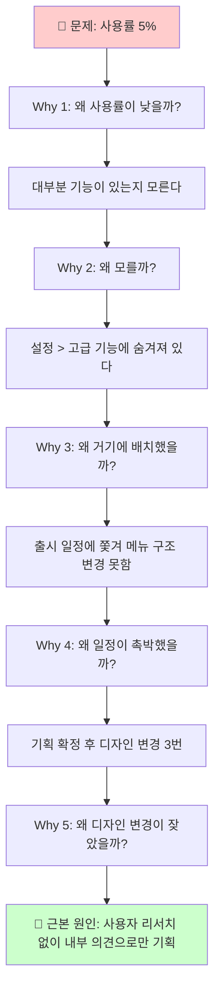

**왜 Tier 1인가:** 가장 단순하고, 어디서든 바로 적용 가능. 복잡한 도구 없이 대화만으로 근본 원인에 도달.

---

## 2. MECE 원칙 (Mutually Exclusive, Collectively Exhaustive)

모든 구조적 사고의 기반. "상호 배타적이고 전체를 포괄하는" 분류 원칙.

### 📋 상황 예시: 매출 하락 원인 분석

> **문제:** 이번 달 매출이 20% 하락했다. 원인을 체계적으로 파악하고 싶다.

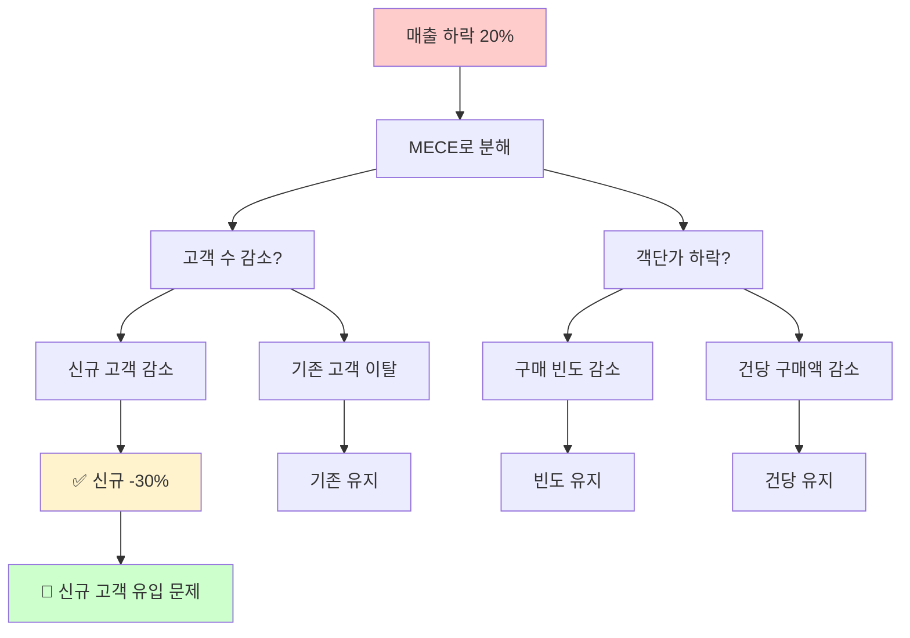

**MECE 체크리스트:**
- ✅ **Mutually Exclusive (상호 배타):** 각 항목이 겹치지 않는가?
- ✅ **Collectively Exhaustive (전체 포괄):** 누락된 항목이 없는가?

**왜 Tier 1인가:** 모든 문제 분해의 기본. Issue Tree, 가설 수립, 분석 프레임워크의 토대.

---

## 3. Hypothesis-Driven Approach (가설 주도 접근법)

McKinsey, BCG 등 전략 컨설팅의 핵심 방법론. 답을 먼저 가정하고 검증한다.

### 📋 상황 예시: 전환율 개선 프로젝트

> **문제:** 가입 → 첫 구매 전환율이 5%다. 15%로 올리고 싶다.

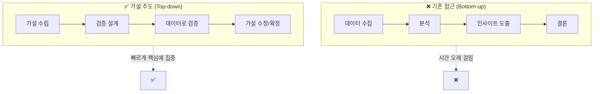

**적용 예시:**

| 단계 | 내용 |
|---|---|
| **가설** | "첫 구매 전환율이 낮은 이유는 온보딩 단계에서 가치를 경험하지 못해서다" |
| **검증 지표** | 온보딩 완료율, 핵심 기능 사용률, 첫 구매까지 소요 시간 |
| **데이터 확인** | 온보딩 완료율 30%, 핵심 기능 미사용 70% |
| **결론** | 가설 지지됨 → 온보딩 개선에 집중 |

**왜 Tier 1인가:** 제한된 시간 내에 핵심에 집중할 수 있게 해주는 실전 방법론.

---

## 4. First Principles Thinking (제1원리 사고)

기존 가정을 모두 제거하고 기본 사실부터 재구축. 혁신적 해결책의 원천.

### 📋 상황 예시: "우리는 엔터프라이즈 고객을 못 잡는다"

> **문제:** B2B SaaS 제품인데 대기업 고객 수주에 계속 실패한다.

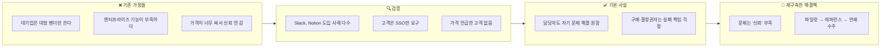

**왜 Tier 1인가:** "원래 그래"라는 고정관념을 깨고 근본적 혁신을 가능하게 함.

---

## 5. Feynman Technique (파인만 기법)

노벨상 수상자 Richard Feynman의 학습법. 설명할 수 있어야 진정으로 아는 것.

### 📋 상황 예시: 새로운 도메인 제품을 맡게 됨

> **문제:** 핀테크 회사에서 "신용평가 모델" 제품을 맡게 됐는데, 전문가들과 대화가 안 된다.

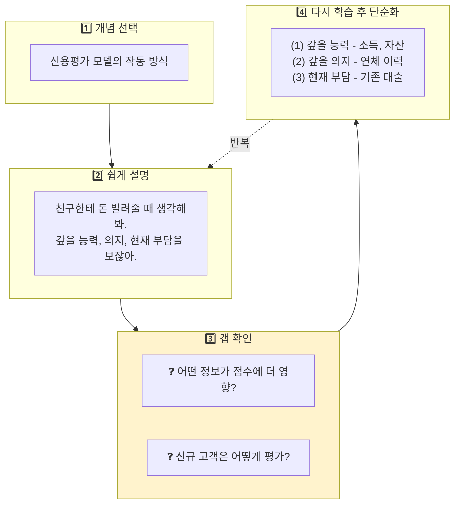

**왜 Tier 1인가:** 새로운 도메인을 깊이 이해하고 전문가와 소통하기 위한 가장 효과적인 학습법.

---

# 🔍 Tier 2: Analysis & Diagnosis (분석 및 진단)

문제를 체계적으로 분석하고 진단하는 방법들.

---

## 6. Inversion (역발상)

"어떻게 성공할까?" 대신 "어떻게 실패할까?"를 먼저 생각. Charlie Munger의 핵심 Mental Model.

### 📋 상황 예시: 신규 서비스 성공 전략

> **문제:** 새 구독 서비스를 출시한다. 성공하려면 어떻게 해야 할까?

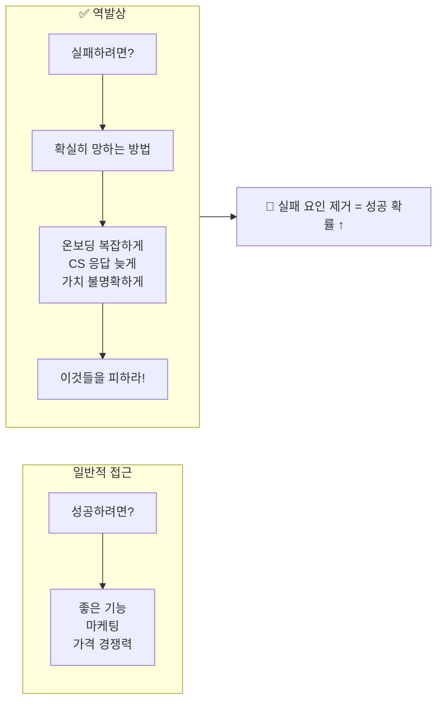

**역발상 질문들:**
- "이 프로젝트를 확실히 망하게 하려면?"
- "고객을 확실히 이탈시키려면?"
- "팀 사기를 바닥으로 떨어뜨리려면?"

**왜 효과적인가:** 성공 요인은 모호하지만, 실패 요인은 명확하다. 실패를 피하면 성공에 가까워진다.

---

## 7. Fishbone Diagram (Ishikawa Diagram)

원인을 카테고리별로 시각적 분류. 복잡한 문제의 다양한 원인을 체계적으로 정리.

### 📋 상황 예시: 구독 서비스 해지율 급증

> **문제:** 해지율이 8%에서 15%로 급증. 여러 부서가 서로 다른 원인을 주장.

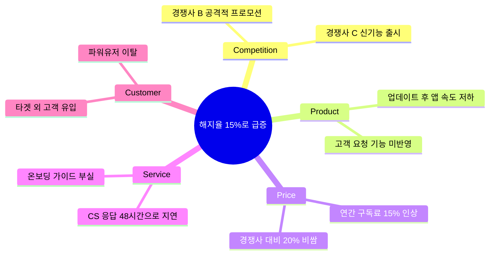

**왜 효과적인가:** 각 부서가 자기 영역만 보는 것을 방지하고, 복합 원인을 인정하게 한다.

---

## 8. Is/Is Not Analysis

문제의 범위를 정확히 정의. "무엇인지"와 "무엇이 아닌지"를 구분.

### 📋 상황 예시: "앱 리뷰가 갑자기 나빠졌어요"

> **문제:** 앱스토어 평점이 4.5에서 3.8로 하락.

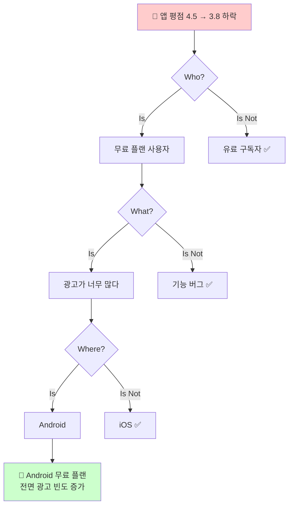

**왜 효과적인가:** 모호한 문제를 구체화하고, 조사 범위를 효과적으로 좁힌다.

---

## 9. End-to-End Tracing (전체 흐름 추적)

프로세스의 처음부터 끝까지 추적. 부분 최적화가 전체를 망치는 케이스 발견.

### 📋 상황 예시: 전환율 하락 원인 분석

> **문제:** 광고 → 가입 전환율이 3%에서 1.8%로 하락.

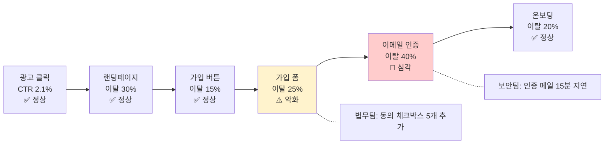

**왜 효과적인가:** 각 부서가 "문제없다"고 할 때, 전체 흐름에서 병목을 찾아낸다.

---

## 10. Pareto Analysis (80/20 법칙)

문제의 80%는 원인의 20%에서 발생. 집중할 곳을 찾는다.

### 📋 상황 예시: CS 문의 폭주

> **문제:** 월 CS 문의 5,000건. 어디부터 손대야 할까?

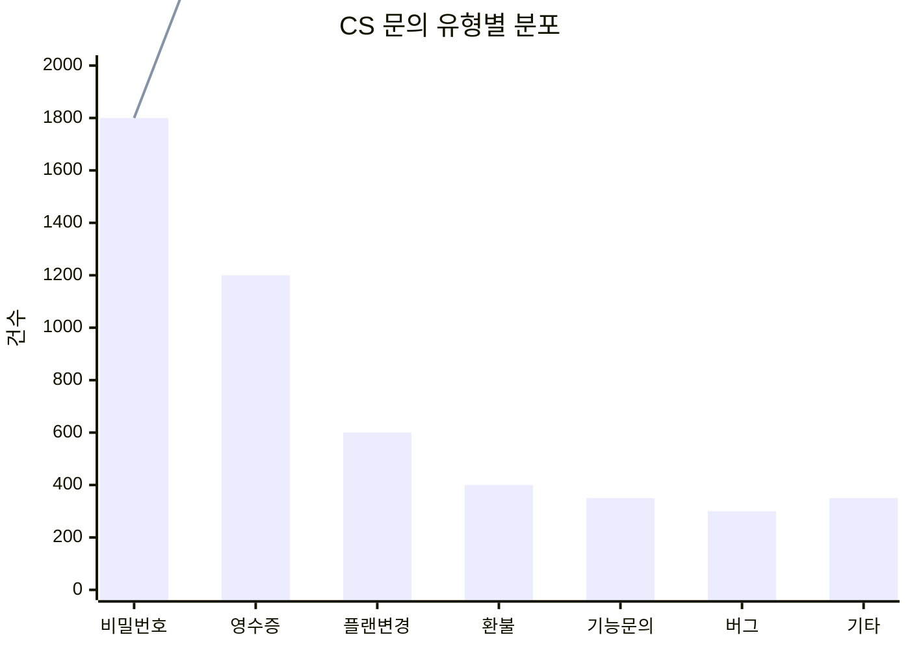

**결론:** 비밀번호 + 영수증 2가지만 해결하면 60% 감소.

**왜 효과적인가:** "다 해야 해"라는 막막함에서 벗어나 최대 효과 지점에 집중.

---

# 🛠️ Tier 3: Systematic Frameworks (체계적 프레임워크)

더 복잡한 문제를 다루는 구조화된 방법론들.

---

## 11. Pre-mortem Analysis (사전 부검)

Gary Klein이 개발. "이미 실패했다"고 가정하고 원인을 역추적. 낙관 편향을 극복.

### 📋 상황 예시: 대규모 리뉴얼 프로젝트

> **상황:** 3개월 후 대규모 앱 리뉴얼 출시 예정. 성공을 확신하지만 불안하다.

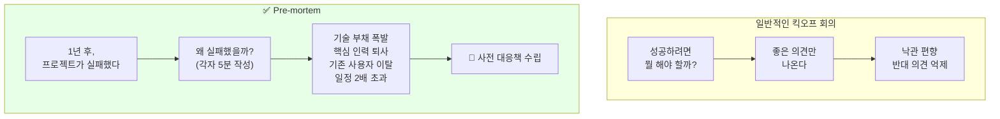

**연구 결과:** 심리학 연구에 따르면, "이미 일어났다"고 상상하면 원인 파악 능력이 30% 향상된다.

**왜 효과적인가:** 반대 의견을 안전하게 낼 수 있는 구조. Daniel Kahneman이 극찬한 방법.

---

## 12. DMAIC (Six Sigma)

데이터 기반 지속적 개선 프레임워크. Define → Measure → Analyze → Improve → Control.

### 📋 상황 예시: 온보딩 완료율 개선

> **문제:** 가입 후 핵심 기능 사용까지 30%만 도달.

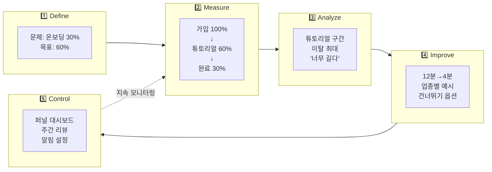

**왜 효과적인가:** 개선 후에도 Control로 지속 모니터링. 일회성이 아닌 지속 개선.

---

## 13. A3 Thinking (Toyota 방식)

Toyota의 문제 해결 방법론. A3 용지 한 장에 문제 정의부터 해결책까지 담는다.

### 📋 A3 리포트 구조

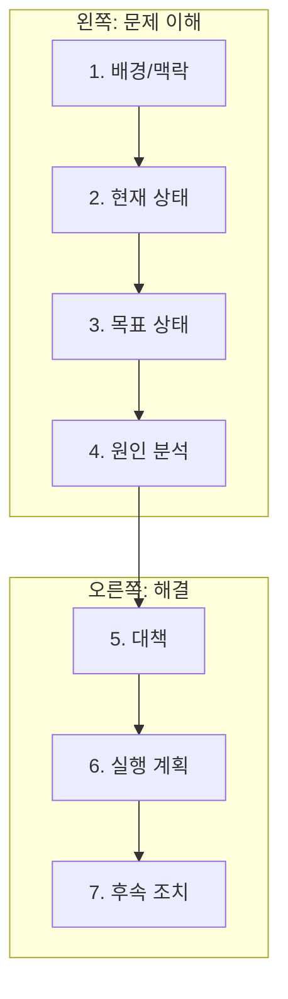

**핵심 원칙:**
- 한 장에 담아야 하므로 본질에 집중
- 문제 이해(좌측)에 50% 이상 할애
- PDCA 사이클과 통합

**왜 효과적인가:** 제약(A3 한 장)이 본질에 집중하게 만든다. Toyota 성공의 비결.

---

## 14. Kepner-Tregoe Analysis

1960년대 개발된 4단계 의사결정 방법론. 체계적이고 문서화된 분석.

### 📋 4단계 프로세스

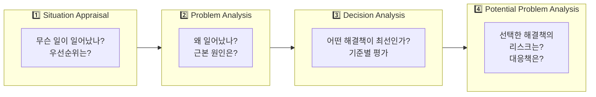

**왜 효과적인가:** 상황 파악 → 원인 분석 → 의사결정 → 리스크 관리까지 일관된 프레임워크.

---

## 15. FTA (Fault Tree Analysis)

실패로부터 역방향으로 모든 원인 경로를 트리 구조로 분석.

### 📋 상황 예시: 고객 이탈 원인 분석

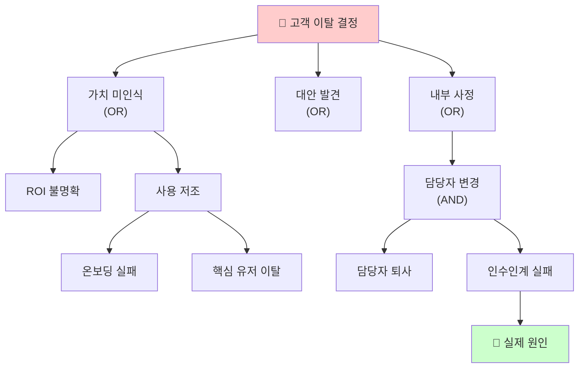

**Gates:** OR(하나라도 발생), AND(모든 조건 충족)

**왜 효과적인가:** 모든 실패 경로를 체계적으로 파악. 예방책 위치를 명확히 한다.

---

## 16. FMEA (Failure Mode and Effects Analysis)

잠재적 실패 모드를 사전에 식별하고 우선순위화.

### 📋 상황 예시: 프로모션 리스크 점검

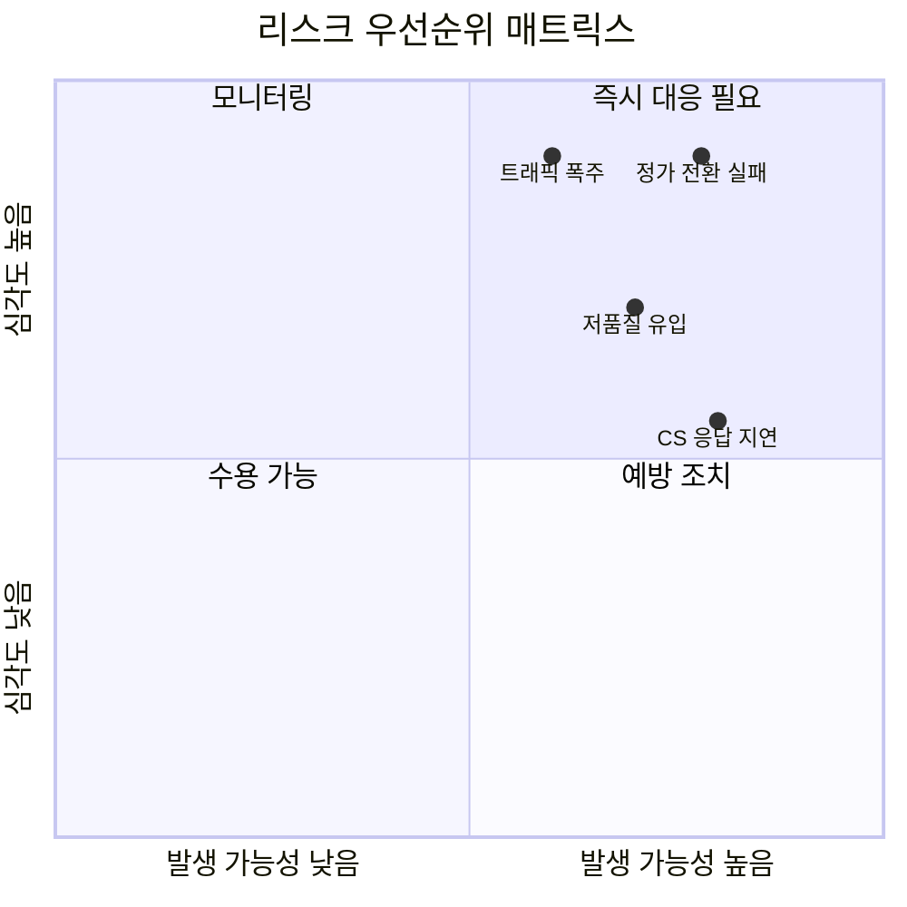

**RPN (Risk Priority Number) = Severity × Occurrence × Detection**

**왜 효과적인가:** "잘 되겠지"라는 낙관에서 벗어나 정량적으로 리스크 우선순위화.

---

# 💡 Tier 4: Creativity & Innovation (창의성 및 혁신)

새로운 아이디어와 혁신적 해결책을 위한 방법들.

---

## 17. Six Thinking Hats (여섯 색깔 모자)

Edward de Bono가 개발. 6가지 관점에서 병렬적으로 사고.

### 📋 6가지 모자

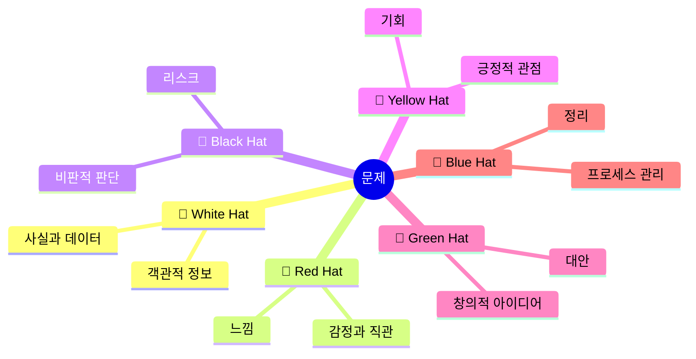

**왜 효과적인가:** 한 사람이 여러 관점을 체계적으로 전환. 논쟁 대신 병렬 사고.

---

## 18. SCAMPER

창의적 아이디어 발상을 위한 7가지 질문 기법.

### 📋 SCAMPER 체크리스트

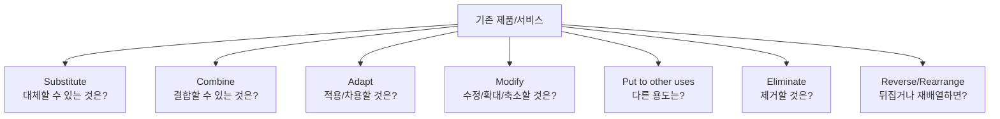

**예시 (구독 서비스 개선):**
- **Substitute:** 월 결제 → 연간 선결제로 대체하면?
- **Combine:** 학습 + 커뮤니티를 결합하면?
- **Eliminate:** 온보딩 과정을 제거하면?

**왜 효과적인가:** 창의적 발상을 구조화. "생각나는 대로" 대신 체계적 탐색.

---

## 19. TRIZ (발명적 문제 해결)

러시아에서 개발된 혁신 방법론. 40가지 발명 원리로 모순을 해결.

### 📋 핵심 개념: 모순 해결

> **문제:** 제품이 "튼튼하면서도 가벼워야" 한다 (모순)

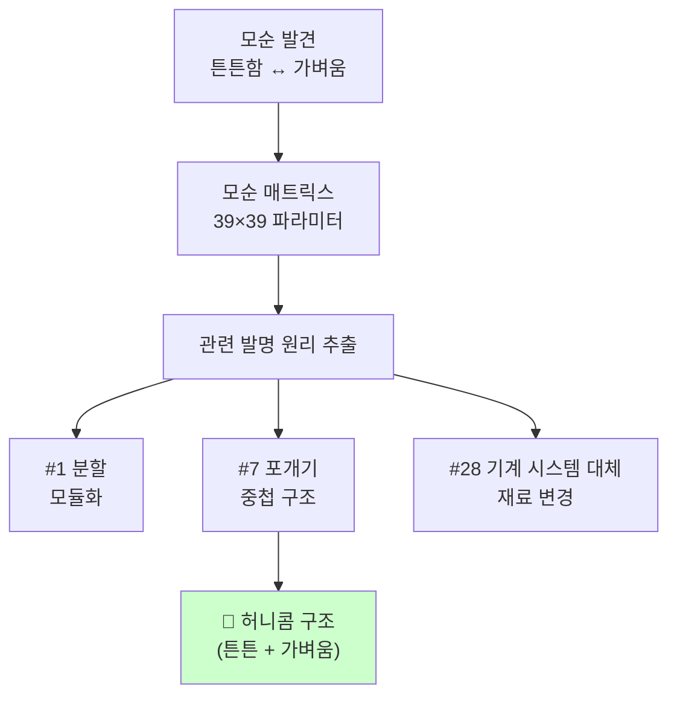

**왜 효과적인가:** Samsung, GE 등 글로벌 기업이 혁신에 활용. 특허 분석에서 도출된 검증된 원리.

---

# 🎯 Tier 5: Decision & Action (의사결정 및 실행)

빠른 의사결정과 실행을 위한 방법들.

---

## 20. OODA Loop

미 공군 전투기 조종사 John Boyd가 개발. 빠른 관찰-판단-결정-행동 사이클.

### 📋 OODA 사이클

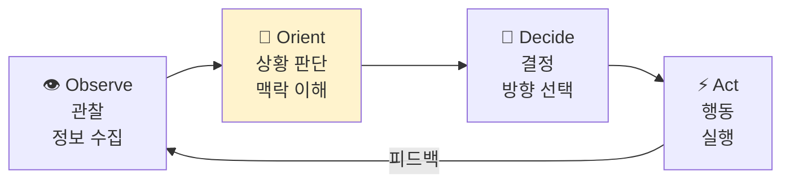

**핵심:** Orient(상황 판단)가 가장 중요. Boyd는 "상대보다 빠른 OODA 사이클"이 승리의 핵심이라 했다.

**적용:**
- 경쟁사보다 빠르게 시장 변화를 파악하고 대응
- 스타트업의 빠른 피벗
- 위기 상황에서의 신속한 의사결정

**왜 효과적인가:** 완벽한 정보 대신 빠른 사이클로 경쟁 우위. JPMorgan CEO Jamie Dimon이 활용.

---

## 21. Socratic Questioning (소크라테스식 질문)

모든 비판적 사고의 기원. 질문을 통해 깊은 이해에 도달.

### 📋 6가지 질문 유형

```mermaid
mindmap
  root((소크라테스식 질문))
    명확화
      그게 무슨 뜻인가요?
      예를 들어주실 수 있나요?
    가정 탐구
      왜 그렇게 가정하나요?
      항상 그런가요?
    증거 탐구
      어떻게 알 수 있나요?
      근거가 뭔가요?
    관점 탐구
      다른 관점에서 보면?
      반대 의견은?
    결과 탐구
      그러면 어떻게 되나요?
      영향은 뭔가요?
    메타 질문
      왜 이 질문이 중요한가요?
      핵심 질문은 뭔가요?
```

**왜 효과적인가:** 2,400년간 검증된 방법. 모든 깊은 사고의 기반.

---

# 🗺️ 종합 Decision Tree

상황에 맞는 방법을 선택하기 위한 가이드.

```mermaid
flowchart TD
    START["🤔 문제 상황"]

    START --> Q1{"문제가<br/>명확한가?"}

    Q1 -->|"아니오<br/>범위가 모호"| SCOPE["📍 범위 정의 필요"]
    SCOPE --> ISNT["Is/Is Not Analysis"]
    SCOPE --> SOCR["Socratic Questioning"]

    Q1 -->|"예"| Q2{"목적이<br/>무엇인가?"}

    Q2 -->|"원인 파악"| CAUSE["🔍 원인 분석"]
    Q2 -->|"해결책 도출"| SOLUTION["💡 해결책 필요"]
    Q2 -->|"의사결정"| DECISION["🎯 의사결정"]
    Q2 -->|"학습/이해"| LEARNING["📚 깊은 이해"]
    Q2 -->|"리스크 파악"| RISK["⚠️ 리스크 관리"]

    %% 원인 분석 브랜치
    CAUSE --> Q3{"원인이<br/>단일? 복합?"}
    Q3 -->|"단일 의심"| WHYS["5 Whys"]
    Q3 -->|"복합 원인"| FISH["Fishbone Diagram"]
    Q3 -->|"프로세스 문제"| E2E["End-to-End Tracing"]
    Q3 -->|"모든 경로 파악"| FTA["Fault Tree Analysis"]

    %% 해결책 브랜치
    SOLUTION --> Q4{"어떤 유형의<br/>해결책?"}
    Q4 -->|"혁신적 접근"| INNOV["혁신 방법론"]
    INNOV --> FIRST["First Principles"]
    INNOV --> TRIZ["TRIZ"]
    INNOV --> SCAMPER["SCAMPER"]

    Q4 -->|"체계적 개선"| SYSTEM["체계적 방법론"]
    SYSTEM --> DMAIC["DMAIC"]
    SYSTEM --> A3["A3 Thinking"]
    SYSTEM --> HYPO["Hypothesis-Driven"]

    Q4 -->|"우선순위 결정"| PRIO["우선순위화"]
    PRIO --> PARETO["Pareto Analysis"]
    PRIO --> MECE["MECE 분해"]

    %% 의사결정 브랜치
    DECISION --> Q5{"의사결정<br/>유형?"}
    Q5 -->|"빠른 판단"| OODA["OODA Loop"]
    Q5 -->|"다각도 검토"| HATS["Six Thinking Hats"]
    Q5 -->|"체계적 평가"| KT["Kepner-Tregoe"]

    %% 학습 브랜치
    LEARNING --> FEYN["Feynman Technique"]

    %% 리스크 브랜치
    RISK --> Q6{"시점이<br/>언제?"}
    Q6 -->|"사전 예방"| PREVENT["사전 분석"]
    PREVENT --> FMEA["FMEA"]
    PREVENT --> PREMORT["Pre-mortem"]
    Q6 -->|"사후 분석"| INV["Inversion"]

    %% 스타일
    style START fill:#e6e6e6
    style WHYS fill:#c8e6c9
    style FISH fill:#c8e6c9
    style FIRST fill:#fff9c4
    style FEYN fill:#bbdefb
    style DMAIC fill:#f0f4c3
    style OODA fill:#ffccbc
    style FMEA fill:#ffcdd2
    style PREMORT fill:#ffcdd2
```

---

# 📊 전체 방법론 요약표

| Tier | 방법 | 핵심 질문 | 최적 상황 |
|---|---|---|---|
| **1** | 5 Whys | "왜?" (반복) | 빠른 근본 원인 파악 |
| **1** | MECE | "겹치지 않고 빠짐없이?" | 문제 구조화, 분해 |
| **1** | Hypothesis-Driven | "가설은? 검증 방법은?" | 시간 제한 내 핵심 집중 |
| **1** | First Principles | "기본 사실은? 가정은?" | 혁신적 접근, 고정관념 타파 |
| **1** | Feynman | "쉽게 설명할 수 있나?" | 새 도메인 학습, 깊은 이해 |
| **2** | Inversion | "어떻게 하면 실패할까?" | 실패 요인 제거 |
| **2** | Fishbone | "원인 카테고리는?" | 복합 원인 분류 |
| **2** | Is/Is Not | "문제인 것/아닌 것?" | 범위 좁히기 |
| **2** | End-to-End | "전체 흐름에서 어디?" | 프로세스 병목 발견 |
| **2** | Pareto | "핵심 20%는?" | 우선순위 결정 |
| **3** | Pre-mortem | "왜 실패했을까?" (가정) | 프로젝트 시작 전 리스크 |
| **3** | DMAIC | "정의→측정→분석→개선→통제" | 데이터 기반 지속 개선 |
| **3** | A3 Thinking | "한 장에 담으면?" | 문제 본질 집중 |
| **3** | Kepner-Tregoe | "상황→원인→결정→리스크" | 체계적 의사결정 |
| **3** | FTA | "모든 실패 경로는?" | 실패 가능성 전수 조사 |
| **3** | FMEA | "리스크 우선순위는?" | 사전 리스크 정량화 |
| **4** | Six Hats | "6가지 관점에서 보면?" | 다각도 검토 |
| **4** | SCAMPER | "대체/결합/적용...하면?" | 창의적 아이디어 발상 |
| **4** | TRIZ | "모순을 어떻게 해결?" | 기술적 혁신 |
| **5** | OODA | "관찰→판단→결정→행동" | 빠른 의사결정 |
| **5** | Socratic | "왜? 어떻게 아나? 다른 관점은?" | 깊은 탐구, 가정 검증 |

---

# 🚀 Quick Reference: 빠른 선택 체크리스트

상황별로 바로 적용할 방법을 찾는 체크리스트.

```mermaid
flowchart TD
    subgraph 즉시["⚡ 즉시 적용 (도구 불필요)"]
        Q1["원인 모르겠다"] --> A1["5 Whys"]
        Q2["범위가 모호하다"] --> A2["Is/Is Not"]
        Q3["뭘 먼저 해야 할지"] --> A3["Pareto 80/20"]
        Q4["새 개념 이해 안 됨"] --> A4["Feynman"]
    end

    subgraph 회의["👥 팀 회의에서"]
        Q5["여러 원인 주장"] --> A5["Fishbone"]
        Q6["다각도 검토 필요"] --> A6["Six Hats"]
        Q7["프로젝트 시작 전"] --> A7["Pre-mortem"]
    end

    subgraph 심층["🔬 심층 분석"]
        Q8["가설 검증 필요"] --> A8["Hypothesis-Driven"]
        Q9["지속적 개선"] --> A9["DMAIC"]
        Q10["혁신이 필요"] --> A10["First Principles"]
    end
```

---

# 🔗 효과적인 방법 조합

단일 방법보다 조합이 더 강력하다.

### 조합 1: 문제 진단 콤보
```
Is/Is Not (범위 좁히기)
    ↓
5 Whys (근본 원인)
    ↓
Fishbone (팀 공유용 시각화)
```

### 조합 2: 개선 프로젝트 콤보
```
Pareto (집중점 선정)
    ↓
Hypothesis-Driven (가설 수립)
    ↓
DMAIC (체계적 개선)
```

### 조합 3: 신규 프로젝트 콤보
```
Pre-mortem (리스크 파악)
    ↓
FMEA (리스크 우선순위)
    ↓
OODA (빠른 실행 사이클)
```

### 조합 4: 혁신 콤보
```
First Principles (가정 깨기)
    ↓
SCAMPER (아이디어 발산)
    ↓
Six Hats (다각도 평가)
```

---

## 마치며

이 21가지 방법을 모두 외울 필요는 없다. Charlie Munger가 말했듯, **"10~20개의 핵심 Mental Model을 자신의 것으로 만들면"** 충분하다.

**추천 학습 순서:**
1. **Tier 1을 완전히 체화** - 5 Whys, MECE, 가설 주도, 제1원리, 파인만
2. **상황에 맞는 Tier 2~3를 점진적으로 추가**
3. **필요시 Tier 4~5에서 선택적으로 활용**

가장 중요한 것은 **"왜?"라는 질문을 멈추지 않는 것**이다.

---

## References

- [5 Whys - ASQ](https://asq.org/quality-resources/five-whys)
- [MECE Principle - McKinsey](https://www.mckinsey.com/capabilities/people-and-organizational-performance/our-insights)
- [Hypothesis-Driven Approach](https://lindsayangelo.com/thinkingcont/hypothesis-driven-problem-solving-explained)
- [First Principles Thinking - Model Thinkers](https://modelthinkers.com/mental-model/first-principle-thinking)
- [Feynman Technique - Farnam Street](https://fs.blog/feynman-technique/)
- [Pre-mortem - HBR](https://hbr.org/2007/09/performing-a-project-premortem)
- [OODA Loop - Wikipedia](https://en.wikipedia.org/wiki/OODA_loop)
- [Six Thinking Hats - De Bono](https://www.debonogroup.com/services/core-programs/six-thinking-hats/)
- [TRIZ - The TRIZ Journal](https://the-trizjournal.com/contradiction-matrix-40-principles-innovative-problem-solving/)
- [A3 Thinking - MIT Sloan](https://sloanreview.mit.edu/article/toyotas-secret-the-a3-report/)
- [Charlie Munger's Mental Models](https://fs.blog/mental-models/)
