## 용어 사전

이 글에서 자주 등장하는 핵심 용어를 먼저 정리한다.

| 용어 | 설명 |
|------|------|
| **MPP** (Massively Parallel Processing) | 다수의 Node가 Query를 분할하여 동시에 처리하는 Architecture |
| **Slot** | BigQuery의 Compute 단위. 가상 CPU + Memory + I/O를 추상화한 Resource Unit |
| **RPU** (Redshift Processing Unit) | Redshift Serverless의 Compute 단위. 1 RPU = 16GB Memory |
| **Columnar Storage** | 데이터를 Row가 아닌 Column 단위로 저장하는 방식. 분석 Query에서 필요한 Column만 읽어 I/O 절감 |
| **Distribution Key** | Redshift에서 데이터를 Node 간에 분산하는 기준 Column. JOIN Performance에 직접 영향 |
| **Sort Key** | Redshift에서 데이터를 디스크에 물리적으로 정렬하는 기준 Column. Filter Performance에 직접 영향 |
| **Partitioning** | BigQuery에서 Table을 날짜/정수 범위 등으로 논리 분할. Scan 범위를 제한하여 비용과 속도 모두 개선 |
| **Clustering** | BigQuery에서 Partition 내 데이터를 특정 Column 기준으로 정렬. 최대 4개 Column 지정 가능 |
| **WLM** (Workload Management) | Redshift의 Query Queue 관리 시스템. Query 종류별 Memory/Concurrency 배분 |
| **ATO** (Automatic Table Optimization) | Redshift가 Query Pattern을 분석하여 Distribution Key/Sort Key를 자동 최적화하는 기능 |
| **Zero-ETL** | Source Database → Data Warehouse로 데이터를 ETL Pipeline 없이 자동 복제하는 기능 |
| **Dry Run** | BigQuery에서 Query를 실행하지 않고 Scan량과 예상 비용만 미리 확인하는 기능. 무료 |
| **AQUA** (Advanced Query Accelerator) | Redshift RA3 Node에서 Storage Layer의 AWS 전용 Processor/FPGA로 사전 Filtering/Aggregation을 수행하는 가속기 |
| **Materialized View** | Query 결과를 사전 계산하여 저장한 View. 반복 Query의 속도를 크게 개선 |
| **BI Engine** | BigQuery의 In-memory Analysis Layer. Sub-second Response로 Dashboard를 가속 |

---

## 들어가며

Cloud Data Warehouse를 선택하는 일은 단순한 기술 비교가 아니다. 조직의 데이터 전략, 운영 문화, 그리고 장기적인 Cloud Roadmap에 깊이 관여하는 의사결정이다.

Google Cloud의 **BigQuery**와 AWS의 **Amazon Redshift**는 각각 근본적으로 다른 설계 철학에서 출발했다. BigQuery는 Google 내부의 Dremel 논문에서 탄생한 Serverless 분석 엔진이고, Redshift는 ParAccel 기반의 MPP(Massively Parallel Processing) Cluster Architecture를 진화시킨 결과물이다.

이 글에서는 두 시스템의 Architecture, Storage, Pricing, Performance, Scalability, Ecosystem, Security, ML/AI Integration은 물론, **Operational Complexity**와 **Console/Developer Experience**까지 깊이 있게 비교한다. 단순히 "어느 것이 더 좋은가"가 아니라, **어떤 상황에서 어떤 선택이 합리적인가**를 판단할 수 있는 Framework를 제시하고자 한다.

---

## 1. Architecture: Serverless vs Cluster

### BigQuery: 완전 Serverless

BigQuery의 Architecture를 이해하려면 먼저 **Storage와 Compute의 완전 분리**라는 핵심 원칙을 알아야 한다.

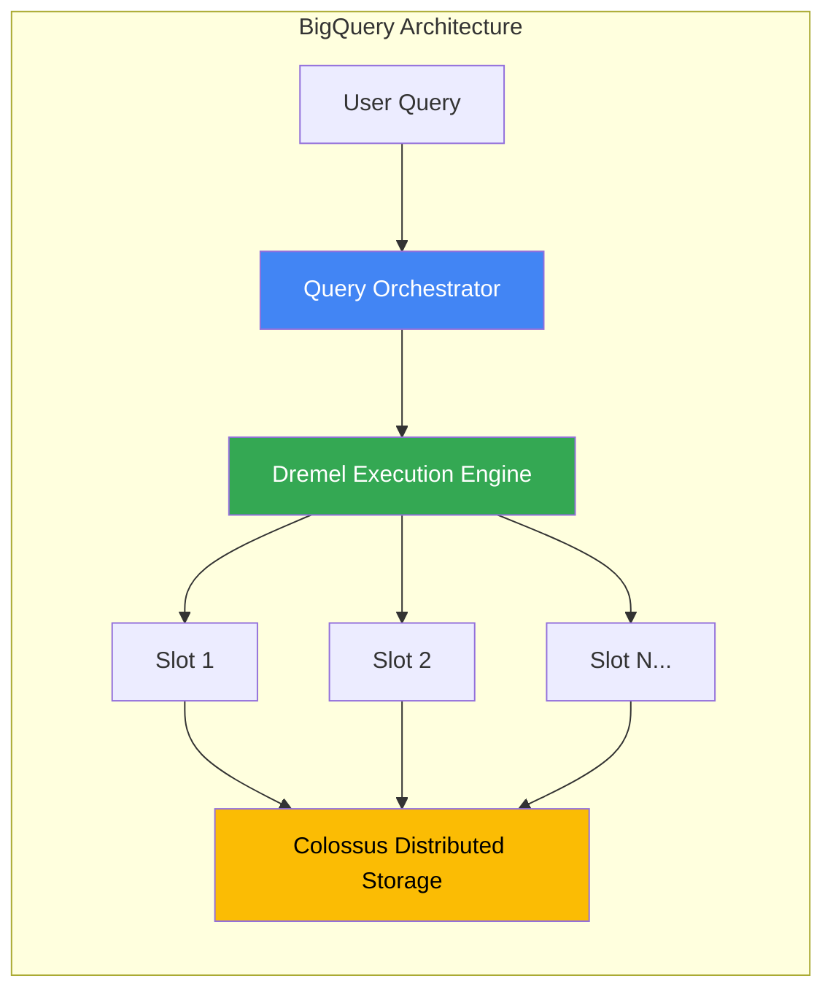

- **Dremel Execution Engine**: Query를 Tree 구조로 분해하여 수천 개의 Worker에서 병렬 실행
- **Colossus**: Google의 Distributed File System 위에 Capacitor Format으로 데이터 저장
- **Jupiter Network**: 5세대 기준 13 Petabits/sec의 Bisectional Bandwidth로 Storage-Compute 간 데이터 이동
- **Borg**: Cluster Management System이 Slot을 동적 할당

사용자는 Infrastructure를 전혀 인식하지 않는다. Query를 제출하면 BigQuery가 필요한 Compute Resource를 즉시 계산하고 할당한다.

### Redshift: MPP Cluster

Redshift는 전통적인 MPP Architecture를 기반으로 하되, 최근 **RA3 Node**와 **Serverless** 옵션으로 유연성을 크게 개선했다.

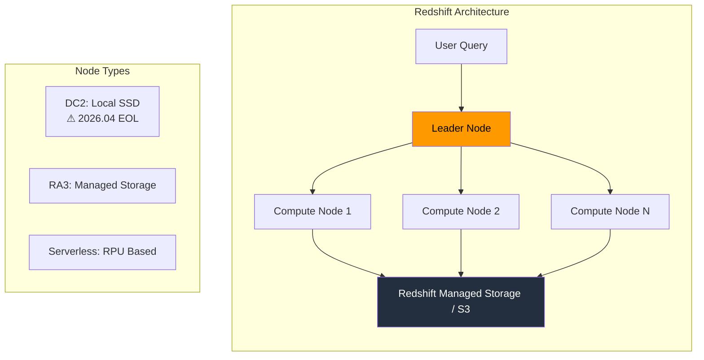

- **Leader Node**: Query Parsing, Execution Plan 수립, 결과 집계
- **Compute Node**: 실제 데이터 처리. Node 유형에 따라 Local SSD(DC2) 또는 Managed Storage(RA3) 사용
- **RA3 Node**: Storage-Compute 분리. 자주 접근하는 데이터는 Local SSD에 Cache
- **Redshift Serverless**: RPU(Redshift Processing Unit) 기반, Idle 시 비용 없음

### Architecture 비교 요약

| 구분 | BigQuery | Redshift |
|------|----------|----------|
| 기본 Model | 완전 Serverless | Cluster 기반 (+ Serverless 옵션) |
| Storage-Compute 분리 | 태생적 분리 | RA3 Node에서 분리 |
| Resource 관리 | 자동 (Slot 기반) | 수동 (Node 선택) 또는 자동 (Serverless) |
| Query 최적화 | Dynamic Execution Plan | Static Execution Plan |
| Infrastructure 가시성 | 없음 (Black Box) | 높음 (Node, Cluster 직접 관리) |

**핵심 차이**: BigQuery는 "얼마나 많은 데이터를 Scan하느냐"가 비용의 핵심이고, Redshift는 "어떤 크기의 Cluster를 얼마나 오래 운영하느냐"가 비용의 핵심이다.

---

## 2. Internal Component 대칭 비교

두 시스템은 내부적으로 비슷한 역할의 Component를 전혀 다른 방식으로 구현하고 있다. 각 Layer를 1:1로 대응시키면 설계 철학의 차이가 선명하게 드러난다.

> Colossus와 Capacitor의 상세 구조는 별도 글 ["Colossus와 Capacitor: BigQuery를 지탱하는 Storage의 구조"](/post/2026/02/08/colossus-capacitor-bigquery-internals-ko/)에서 다룬다. Redshift의 내부 Architecture 상세 분석은 ["Amazon Redshift의 내부 Architecture: ParAccel에서 Serverless까지"](/post/2026/02/08/redshift-internals-architecture-ko/)를 참고한다.

### Component Map

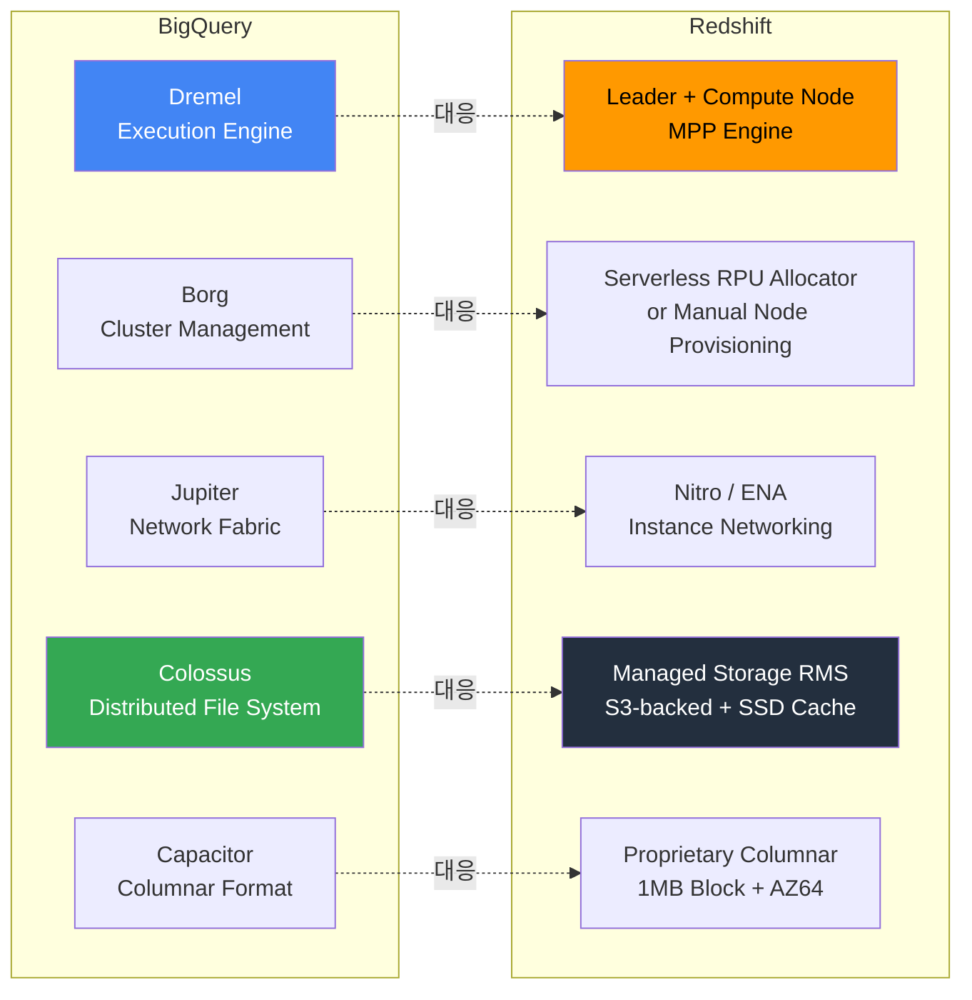

### Layer 1: Execution Engine

| 구분 | BigQuery (Dremel) | Redshift (MPP Engine) |
|------|-------------------|----------------------|
| 실행 구조 | **Tree 구조** (Root → Mixer → Leaf) | **2-tier** (Leader → Compute Node/Slice) |
| 중간 집계 | Mixer Node가 Streaming Merge | 중간 Layer 없음. Leader가 최종 집계 |
| Query Plan | **Dynamic** (실행 중 재조정) | **Static** (실행 전 확정) |
| Code Generation | 내부 실행 엔진 | **C++ 코드 생성 → GCC 컴파일** → Compute Node에 배포 |
| SIMD 활용 | 내부 Vectorized Processing | **AVX2 Intrinsic** 직접 작성 |
| Compilation Cache | - | Local + Global Cache. 전용 Compilation Node 분리 |
| Hardware 가속 | - | **AQUA**: RA3 전용 FPGA/Custom Silicon. Storage Layer에서 Scan/Filter/Aggregation 사전 처리 |

**비용/성능 관점**:
- Dremel은 Tree 구조로 Aggregation을 분산하므로 **대규모 Concurrent Query에 강하다**. Mixer가 중간 집계를 담당하여 Root에 부하가 집중되지 않는다.
- Redshift는 Leader Node가 Single Point of Bottleneck이 될 수 있다. 반면 **AQUA가 Storage Layer에서 사전 처리**하여 데이터를 5%까지 줄인 후 Compute에 전달하므로, Scan-heavy Query에서는 큰 이점이 있다.

### Layer 2: Resource Management

| 구분 | BigQuery (Borg) | Redshift |
|------|----------------|----------|
| 할당 단위 | **Slot** (가상 CPU) | **Slice** (Provisioned) / **RPU** (Serverless) |
| RPU 정의 | - | 1 RPU = 16GB Memory + 2 vCPU |
| Scheduling | **Fair Scheduling** (Project 간 균등 배분) | **WLM Queue** (Priority 기반) |
| Scaling | 완전 자동. Query 단위로 Slot 할당/반환 | Serverless: AI-driven 자동 / Provisioned: 수동 |
| 최소 단위 | On-Demand: 공유 Pool / Edition: 100 Slot | Serverless: 4 RPU (64GB) |
| Fault Tolerance | Borg가 자동 복구 | Leader Node 장애 시 Cluster 재시작 필요 |

**비용/성능 관점**:
- BigQuery는 Query가 끝나면 Slot이 즉시 반환되므로 **Idle 비용이 0**이다 (On-Demand).
- Redshift Provisioned는 Cluster가 켜져 있는 동안 계속 과금된다. Serverless는 Idle 시 Compute 비용 0이지만, **Cold Start Latency**가 있다.

### Layer 3: Network

| 구분 | BigQuery (Jupiter) | Redshift (Nitro/ENA) |
|------|-------------------|---------------------|
| Bandwidth | Data Center Fabric: **13 Pb/s** | Instance Level: 최대 **100 Gbps** |
| Scale | 10만 Machine 간 All-to-all 통신 | Node 간 통신 |
| 세대 | 5세대 Jupiter. OCS(Optical Circuit Switch)로 Spine 제거 | Nitro System. ENA Express로 Single Flow 25 Gbps |
| Storage 통신 | Colossus D Server와 RDMA-like Direct 통신 | S3 기반 Managed Storage와 HTTP/S3 API |

**비용/성능 관점**:
- Jupiter의 **13 Pb/s**는 Data Center 전체 Fabric 대역폭으로, BigQuery Slot이 Colossus에서 데이터를 읽을 때 Network이 Bottleneck이 되지 않는다.
- Redshift RA3의 Network은 Instance 수준이므로, **대량 Data Redistribution(잘못된 Distribution Key) 시 Network이 병목**이 될 수 있다.

### Layer 4: Storage System

| 구분 | BigQuery (Colossus) | Redshift (Managed Storage/RMS) |
|------|--------------------|-----------------------------|
| 기반 | Google Distributed File System (GFS 후속) | **Amazon S3** + Local SSD Cache |
| Scale | **Exabyte** (단일 Cluster) | RA3: 16PB, Serverless: 8PB |
| Durability | Zone 내 **11 nines** | S3: **11 nines** |
| Replication | **Reed-Solomon RS(6,3)** — 1.5x Overhead | S3 내부 Replication (사용자 비가시) |
| Caching | Colossus가 자체 관리 | RA3 Local SSD에 Hot Data 자동 Cache |
| 비용 | Active: $20/TB, Long-term: **$10/TB** | **$24.58/TB** (Hot/Cold 구분 없이 동일) |

**비용/성능 관점**:
- BigQuery는 90일 이상 미변경 데이터가 자동으로 **Long-term Storage($10/TB)**로 전환되어 **Storage 비용이 절반**이 된다.
- Redshift RMS는 Hot/Cold 구분 없이 동일 가격이므로, **대량의 Historical Data를 보관할 때 BigQuery가 유리**하다.

### Layer 5: Columnar Format

| 구분 | BigQuery (Capacitor) | Redshift (Proprietary Columnar) |
|------|---------------------|-------------------------------|
| Block Size | 가변 | 고정 **1MB** |
| Compressed Query | ✅ Mini Query Processor로 직접 실행 | 제한적 (BYTEDICT Encoded String만) |
| Row Reordering | ✅ Approximation Algorithm. 평균 17% 절감 | ❌ (Sort Key로 사용자가 수동 지정) |
| 주요 Encoding | Dictionary, RLE, Delta, Bit-Vector (자동 선택) | **AZ64**, ZSTD, LZO, BYTEDICT (자동 또는 수동) |
| AZ64 특징 | - | XOR Delta + SIMD 가속. 숫자/날짜에 최적화 |
| Block Metadata | Min/Max Statistics | **Zone Map** (Min/Max per 1MB Block) |
| Compression Ratio | 일반적으로 **3:1 ~ 10:1** | 일반적으로 **2:1 ~ 6:1** |
| Open Format | ❌ | ❌ |

**비용/성능 관점**:
- Capacitor의 **Compressed Query**는 I/O와 CPU를 모두 절약한다. BigQuery On-Demand에서 Scan량 기반 과금이므로, 높은 Compression은 **직접적인 비용 절감**으로 이어진다.
- Redshift의 **AZ64**은 SIMD를 활용한 빠른 Decompression에 초점을 맞춘다. Scan 속도는 빠르지만, Decompress 후 처리하므로 Memory 사용량이 더 크다.
- Redshift의 **Zone Map**은 Sort Key와 밀접하게 연결된다. Sort Key를 잘 선택하면 Zone Map Pruning 효과가 극대화되지만, 잘못 선택하면 효과가 거의 없다.

---

## 3. Storage Format

### BigQuery: Capacitor

BigQuery는 자체 개발한 **Capacitor** Columnar Format을 사용한다. Capacitor의 핵심 혁신은 다음과 같다:

- **Compressed 상태에서 직접 Query**: 데이터를 Decompress하지 않고도 Query 실행 가능. I/O와 CPU 모두 절약
- **Row Reordering 최적화**: Approximation Algorithm으로 행 순서를 재배치하여 Compression 효율 극대화
- **단일 파일 내 Column 분리**: 각 Column은 별도 File Block에 저장되지만, 하나의 Capacitor 파일로 관리
- **자동 Encoding 선택**: 데이터 특성에 따라 Dictionary, Run-Length, Delta 등 최적 Encoding 자동 적용

### Redshift: Columnar Storage

Redshift는 표준 Columnar Storage 방식을 사용하며, 다양한 Compression Encoding을 지원한다:

- **AZ64**: Amazon 자체 개발 Compression Algorithm. 숫자/날짜 타입에 최적화
- **ZSTD (Zstandard)**: 범용 High Compression Algorithm
- **LZO, BYTEDICT, RUNLENGTH** 등 다양한 Encoding 옵션
- **ANALYZE COMPRESSION**: 데이터 특성에 맞는 최적 Encoding을 자동 추천

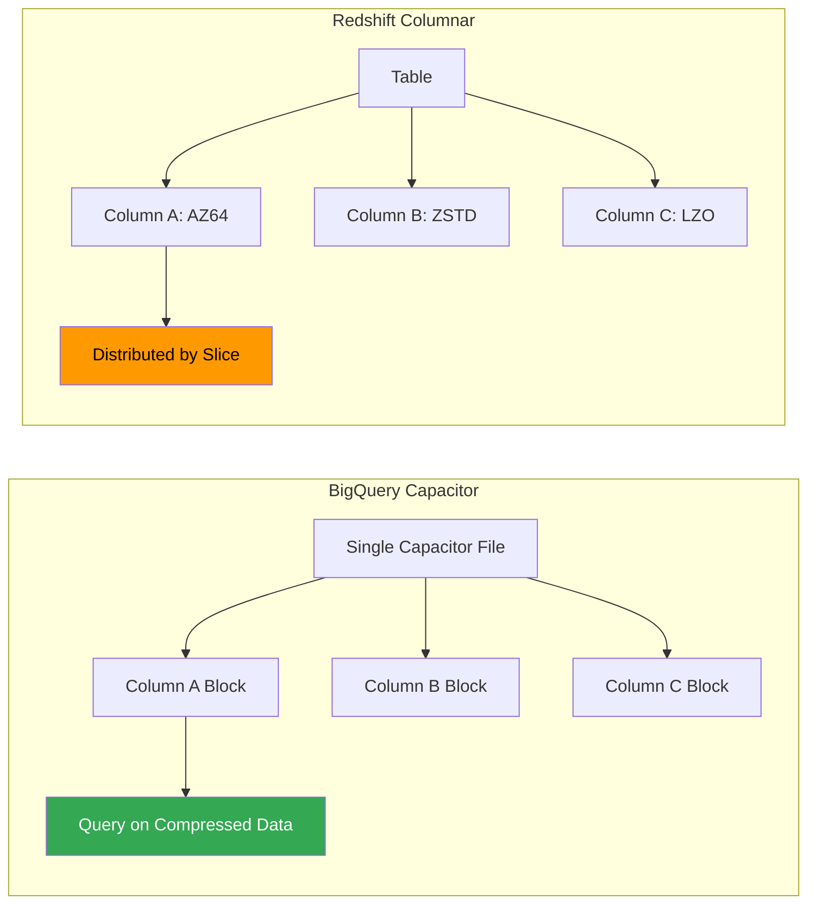

### Distribution Key와 Sort Key

Redshift에서는 **Distribution Key**와 **Sort Key**를 직접 지정해야 한다. 이 선택이 Query Performance에 결정적 영향을 미친다:

- **EVEN Distribution**: Round-Robin 방식. JOIN이 없는 Table에 적합
- **KEY Distribution**: 특정 Column 값 기준 분산. 자주 JOIN하는 Table 간 Co-location
- **ALL Distribution**: 모든 Node에 전체 복제. 작은 Dimension Table에 적합
- **AUTO Distribution**: Redshift가 데이터 크기와 Query Pattern을 분석하여 자동 선택

BigQuery는 이런 물리적 데이터 배치를 사용자가 지정할 필요가 없다. 대신 **Partitioning**(날짜, 정수 범위, Ingestion Time)과 **Clustering**(최대 4개 Column)으로 Query Performance를 최적화한다.

| 구분 | BigQuery | Redshift |
|------|----------|----------|
| Tuning Point | Partitioning + Clustering | Distribution Key + Sort Key |
| 복잡도 | 낮음 (2가지 선택) | 높음 (Distribution/Sort 전략 조합) |
| 실수 비용 | 낮음 (자동 최적화) | 높음 (잘못된 Key 선택 시 Performance 급감) |
| DBA 의존도 | 낮음 | 높음 |

---

## 4. Pricing

Pricing은 두 서비스를 비교할 때 가장 복잡하고 중요한 영역이다. 두 서비스 모두 여러 Pricing Model을 제공하며, Workload Pattern에 따라 최적 선택이 달라진다.

### BigQuery Pricing

**On-Demand (종량제)**
| 항목 | 가격 |
|------|------|
| Query 처리 | $6.25 / TB Scanned |
| Free Query | 매월 1TB |
| Active Storage | $0.02 / GB·월 (~$20/TB) |
| Long-term Storage (90일+) | $0.01 / GB·월 (~$10/TB) |
| Streaming Insert | $0.05 / GB |
| Free Storage | 매월 10GB |

**Editions (Slot 기반)**
| Edition | Pay-as-you-go (Slot·시간) | 1년 Commitment | 3년 Commitment |
|---------|--------------------------|----------------|----------------|
| Standard | $0.04 | - | - |
| Enterprise | $0.06 | $0.048 | $0.036 |
| Enterprise Plus | $0.10 | $0.080 | $0.060 |

- 최소 100 Slot 단위 구매
- Slot Autoscaling 지원
- Project 간 Slot 공유 가능

### Redshift Pricing

**Provisioned Cluster**
| Node Type | On-Demand (시간당) | 특징 |
|-----------|-------------------|------|
| DC2.large | $0.25 | 160GB SSD, 2 vCPU ⚠️ |
| DC2.8xlarge | $4.80 | 2.56TB SSD, 32 vCPU ⚠️ |
| RA3.xlplus | $1.086 | 32TB Managed Storage |
| RA3.4xlarge | $3.26 | 128TB Managed Storage |
| RA3.16xlarge | $13.04 | 128TB Managed Storage |

> ⚠️ DC2 Node는 **2026년 4월 24일 End-of-Life** 예정. 2025년 5월 15일 이후 신규 DC2 Cluster 생성 불가. RA3 또는 Serverless로 Migration 필요.

**Serverless**
| 항목 | 가격 |
|------|------|
| Compute | RPU-시간당 $0.375 ~ $0.494 (Region별) |
| Managed Storage | $0.024 / GB·월 (~$24.58/TB) |
| Minimum Billing | 60초 |
| Idle 시 | Compute 비용 없음 |

**Reserved Instance (1년/3년)**
- On-Demand 대비 최대 75% 절감
- All Upfront, Partial Upfront, No Upfront 옵션

### 비용 Scenario 비교

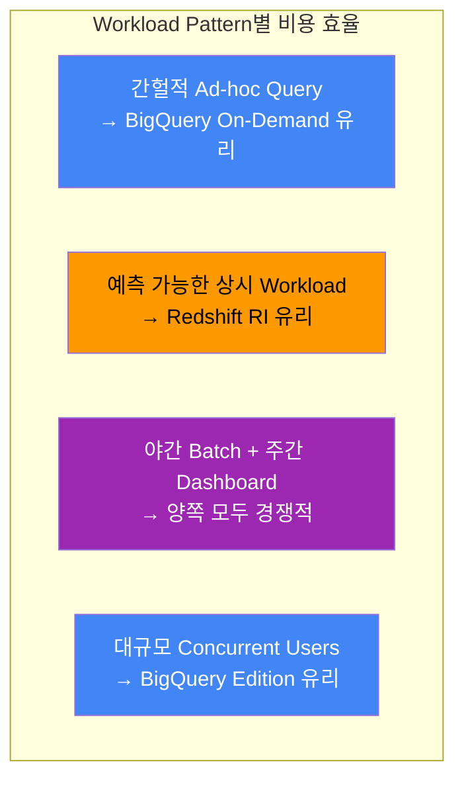

**실무 팁**:
- BigQuery On-Demand는 Scan량 기준 과금이므로, **Partitioning과 Clustering으로 Scan량을 줄이는 것**이 비용 절감의 핵심
- Redshift는 Cluster가 켜져 있는 동안 계속 과금되므로, **사용하지 않을 때 Cluster를 Pause**하거나 Serverless로 전환하는 것이 효과적
- 월 $10,000 이상 지출 시 양쪽 모두 Commitment Discount를 적극 검토해야 한다

---

## 5. Performance

### Query Execution Model

**BigQuery**:
- Query를 Execution Tree로 분해
- **Dynamic Execution Plan**: 실행 중에도 Resource 재배분 가능
- Shuffle 단계에서 중간 결과를 Colossus에 기록 → Fault Tolerance 높음
- Slot 단위로 Parallelism 제어

**Redshift**:
- Leader Node에서 **Static Execution Plan** 생성
- 각 Compute Node의 Slice에서 병렬 실행
- Network Redistribution 비용이 Performance에 큰 영향
- AQUA(Advanced Query Accelerator)로 Storage Layer에서 사전 Filtering/Aggregation

### Benchmark 관점

TPC-DS 99개 Query 기준 (2025년 자료):

| 구분 | BigQuery | Redshift |
|------|----------|----------|
| 총 비용 | ~$511 | ~$111 |
| Simple Query (≤100GB) | 양쪽 유사 | 양쪽 유사 |
| Complex JOIN Query | 우위 | 보통 |
| Large Scan | 보통 | 우위 (RI 활용 시) |

> ⚠️ Benchmark는 참고 자료일 뿐이다. 실제 Performance는 Data Model, Query Pattern, Table Design, Optimization 수준에 따라 크게 달라진다. **반드시 실제 Workload로 PoC를 진행해야 한다.**

### Performance Optimization 전략

**BigQuery Optimization**:
1. **Partitioning**: 날짜 기반 Partitioning으로 Scan 범위 제한
2. **Clustering**: 자주 Filtering하는 Column으로 Clustering
3. **SELECT \* 회피**: 필요한 Column만 선택 (Columnar Format의 이점 활용)
4. **Materialized View**: 반복 Query 결과 사전 계산
5. **BI Engine**: Sub-second Response가 필요한 Dashboard에 활용

**Redshift Optimization**:
1. **Distribution Key 선정**: JOIN 빈도가 높은 Column을 Distribution Key로
2. **Sort Key 선정**: WHERE 절에 자주 등장하는 Column을 Sort Key로
3. **VACUUM & ANALYZE**: 정기적 실행으로 Statistics 갱신
4. **Concurrency Scaling**: Peak 시간대 자동 확장
5. **Automated Materialized View**: ML 기반 자동 생성/관리

---

## 6. Scalability

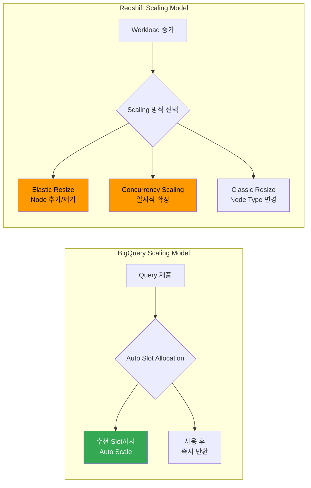

| 구분 | BigQuery | Redshift |
|------|----------|----------|
| Scaling 방식 | 완전 자동 | 수동/반자동 |
| Scaling 속도 | 즉시 | Elastic: 수 분, Classic: 수십 분 |
| Scale-down | 자동 (사용 후 반환) | 수동 Resize 필요 |
| Max Storage | 사실상 무제한 | RA3: 16PB, Serverless: 8PB |
| Concurrent Query | Slot Pool 기반 자동 관리 | WLM Queue + Concurrency Scaling |
| Zero-downtime | 기본 제공 | Elastic Resize에서만 최소 Downtime |

**BigQuery의 강점**: 예측 불가능한 Workload에서 빛난다. 갑자기 100명의 Analyst가 동시에 Dashboard를 열어도 자동 대응한다.

**Redshift의 강점**: 예측 가능한 Workload에서 비용 효율이 높다. 필요한 만큼만 Provisioning하고, Reserved Instance로 비용을 크게 절감할 수 있다.

---

## 7. Workload Management와 Concurrency

### BigQuery: Slot 기반

BigQuery는 **Slot**이라는 가상 CPU 단위로 Compute Resource를 관리한다.

- **On-Demand**: Google이 관리하는 공유 Slot Pool 사용. 별도 설정 불필요
- **Edition**: 조직 전용 Slot Reservation. Project/팀 간 Slot 배분 가능
- **Query Priority**:
  - `INTERACTIVE`: 즉시 실행 (기본값)
  - `BATCH`: Idle Resource가 있을 때 실행. 실행 시작 전 대기 Timeout 24시간

### Redshift: WLM (Workload Management)

Redshift는 **Queue** 기반의 Workload Management System을 제공한다.

**Automatic WLM** (권장):
- ML이 Query 특성을 분석하여 Memory와 Concurrency를 자동 조정
- 최대 8개 Queue (Service Class 100~107)
- Queue 간 Priority 설정 가능

**Manual WLM**:
- 직접 Concurrent Query 수와 Memory 비율 설정
- 세밀한 제어가 필요한 경우

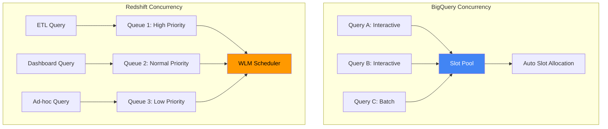

| 구분 | BigQuery | Redshift |
|------|----------|----------|
| Management Model | Slot 기반 Auto Allocation | Queue 기반 Scheduling |
| 설정 복잡도 | 낮음 | 중간~높음 |
| Priority Control | Interactive / Batch | Multi-Queue + Priority Weight |
| Peak 대응 | Auto Slot Scaling | Concurrency Scaling (추가 과금) |
| Fine-grained Control | 제한적 | 매우 세밀함 |

---

## 8. Ecosystem Integration

### GCP + BigQuery Ecosystem

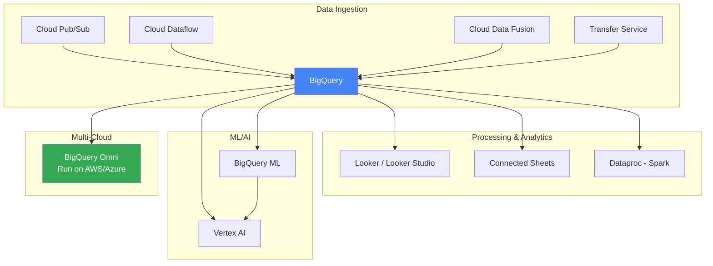

**BigQuery Ecosystem 특징**:
- **Pub/Sub → BigQuery Direct Subscription**: 중간 처리 없이 Streaming Data 직접 적재
- **BigQuery Omni**: AWS S3나 Azure Blob에 있는 데이터를 BigQuery SQL로 직접 Query
- **BI Engine**: BigQuery 위에서 Sub-second Response의 In-memory Analytics Layer
- **Looker Studio**: 무료 Dashboard/Reporting 도구와 Native Integration

### AWS + Redshift Ecosystem

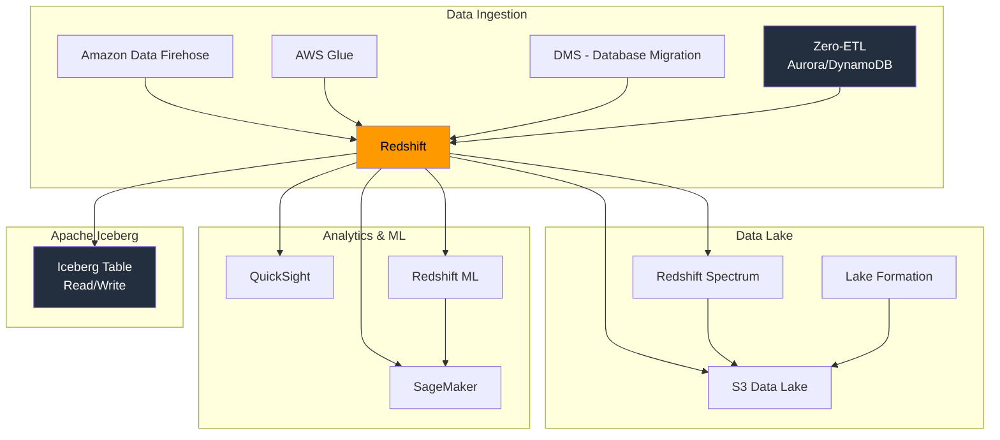

**Redshift Ecosystem 특징**:
- **Zero-ETL**: Aurora MySQL/PostgreSQL, RDS for MySQL, DynamoDB에서 ETL Pipeline 없이 자동 복제 (DB 소스는 15초 이내, SaaS 소스는 최소 1시간 Lag)
- **Redshift Spectrum**: S3의 데이터를 직접 Query. Parquet, ORC, JSON, Avro, CSV 지원
- **Apache Iceberg Integration**: ACID Transaction 지원 Data Lake 운영
- **SageMaker Unified Studio**: ML 개발과 Analytics 도구를 단일 Interface에서 통합

### Ecosystem 비교 요약

| 영역 | BigQuery (GCP) | Redshift (AWS) |
|------|---------------|----------------|
| Real-time Ingestion | Pub/Sub Direct Subscription | Kinesis / Data Firehose Streaming Ingestion |
| ETL/ELT | Dataflow (Apache Beam) | Glue (Spark 기반) |
| Zero-ETL | 제한적 | Aurora, RDS for MySQL, DynamoDB 등 풍부 |
| Data Lake | BigQuery Omni (Multi-cloud) | Spectrum + Iceberg |
| BI Tool | Looker Studio (무료) | QuickSight (유료) |
| ML Integration | BigQuery ML + Vertex AI | Redshift ML + SageMaker |
| Multi-cloud | BigQuery Omni | 제한적 |

---

## 9. Data Sharing

### BigQuery Analytics Hub

- GCP Organization 내 및 Organization 간 Dataset Publishing/Subscription
- **Cross-region Query**: BigQuery Omni Region과 Google Cloud Region 간 Cross Join 가능
- Marketplace 형태의 Data Sharing Platform

### Redshift Data Sharing

- 같은 AWS Account 또는 Cross-account 간 Data Sharing
- **RA3 Node 또는 Serverless 필수**: DC2에서는 Data Sharing 불가
- 별도의 데이터 복사 없이 Live Data 접근
- AWS Data Exchange와 연동하여 외부 Data Marketplace 참여 가능

| 구분 | BigQuery | Redshift |
|------|----------|----------|
| Sharing 단위 | Dataset | Database/Schema/Table |
| Cross-account | 지원 | 지원 (RA3 / Serverless) |
| Multi-cloud | BigQuery Omni로 가능 | 제한적 |
| Marketplace | Analytics Hub | AWS Data Exchange |
| 비용 | Subscriber가 Query 비용 부담 | Consumer Cluster의 Compute 사용 |

---

## 10. ML/AI Integration

Data Warehouse에서 직접 ML을 실행하는 것은 Data Movement 비용을 줄이는 핵심 전략이다.

### BigQuery ML + Vertex AI

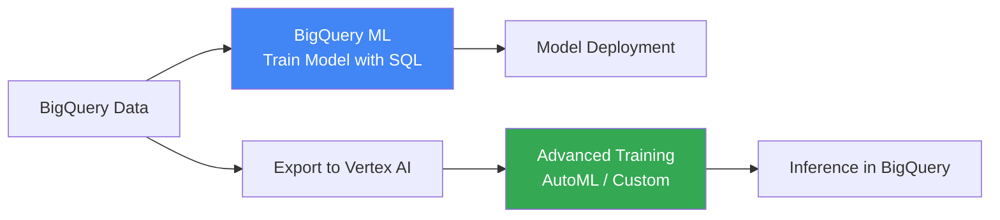

**BigQuery ML 지원 Model**:
- Linear/Logistic Regression, K-means, Time Series (ARIMA_PLUS)
- XGBoost, DNN, Wide & Deep
- 외부 TensorFlow Model Import
- LLM Remote Call (Gemini 등)

```sql
-- BigQuery ML 예시: Customer Churn Prediction
CREATE OR REPLACE MODEL `project.dataset.churn_model`
OPTIONS(model_type='LOGISTIC_REG',
        input_label_cols=['is_churned']) AS
SELECT
  user_tenure_days,
  total_purchases,
  last_login_days_ago,
  support_tickets_count,
  is_churned
FROM `project.dataset.user_features`;
```

### Redshift ML + SageMaker

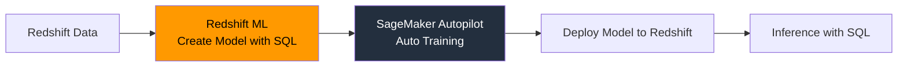

**Redshift ML**:
- `CREATE MODEL` SQL 문으로 Model 생성
- SageMaker Autopilot이 자동으로 Preprocessing, Training, Tuning
- 학습된 Model을 Redshift 내에서 SQL Function으로 호출
- 데이터가 S3를 경유하므로 대용량 Training에 적합

```sql
-- Redshift ML 예시: Customer Churn Prediction
CREATE MODEL churn_model
FROM (
    SELECT user_tenure_days,
           total_purchases,
           last_login_days_ago,
           support_tickets_count,
           is_churned
    FROM user_features
)
TARGET is_churned
FUNCTION predict_churn
IAM_ROLE 'arn:aws:iam::role/RedshiftML'
SETTINGS (
    S3_BUCKET 'my-ml-bucket'
);
```

| 구분 | BigQuery ML | Redshift ML |
|------|-------------|-------------|
| Training 위치 | BigQuery 내부 | SageMaker (S3 경유) |
| SQL Interface | CREATE MODEL | CREATE MODEL |
| Model 다양성 | 높음 (DNN, XGBoost, ARIMA 등) | SageMaker Autopilot 의존 |
| Custom Model | TF Model Import, Vertex AI 연동 | SageMaker 전체 기능 활용 |
| LLM Integration | Gemini Remote Call 가능 | Bedrock 연동 |
| Data Movement | 없음 | S3로 Export 필요 |

---

## 11. Security와 Compliance

두 서비스 모두 Enterprise급 Security를 제공하지만, 접근 방식에 차이가 있다.

| 구분 | BigQuery | Redshift |
|------|----------|----------|
| 기본 Encryption | At-rest + In-transit 자동 Encryption | At-rest AES-256 자동 (2019.07 이후 Default) |
| Key Management | Cloud KMS / CMEK | AWS KMS |
| Fine-grained Access Control | Column/Row Level Security | Column/Row Level Security |
| Network Isolation | VPC Service Controls | VPC 내 배포 |
| Data Masking | Cloud DLP Integration | Dynamic Data Masking |
| HIPAA | BAA로 전체 GCP Cover | 지원 |
| SOC | SOC 1/2/3 | SOC 1/2/3 |
| FedRAMP | 지원 | Serverless도 지원 (2025~) |
| PCI-DSS | 지원 | 지원 |

---

## 12. 최신 주요 Feature (2025-2026)

### BigQuery 신기능

- **BigQuery Advanced Runtime**: 개선된 Query Execution Engine. Slot 효율성 향상
- **Conversational Analytics API** (Preview → 2026.01 전면 공개): 자연어로 데이터 Query
- **Gemini in Looker**: LookML Code 및 Visualization 자동 생성
- **Partition Skew Detection**: 불균형한 Partition 자동 분석

### Redshift 신기능

- **Zero-ETL 확장**: Aurora MySQL/PostgreSQL, RDS for MySQL, DynamoDB 기본 지원. Application 연동(Salesforce, ServiceNow, Zendesk)은 최소 1시간 Lag으로 특성이 다름
- **Multidimensional Data Layouts**: 최대 10배 Price-performance 개선
- **Apache Iceberg Read/Write**: Data Lake Query Performance 2배 향상
- **Distributed Warehouse Architecture**: Workload Isolation을 위한 독립 Compute
- **Serverless Reservations**: Serverless Compute 비용 최대 24% 절감

---

## 13. Operational Complexity: Redshift는 BigQuery만큼 편해질 수 있는가

Redshift를 처음 접하는 팀이 가장 부담스러워하는 것은 **Distribution Key, Sort Key, WLM Tuning**이다. BigQuery에서는 존재하지 않는 개념이기 때문에, 이 차이만으로 BigQuery를 선택하는 조직도 적지 않다.

그렇다면 2026년 현재, Redshift는 이 Gap을 얼마나 줄였을까?

### Redshift의 자동화 진화

Redshift는 최근 몇 년간 **Automatic Table Optimization (ATO)**을 중심으로 DBA 의존도를 적극적으로 낮추고 있다.

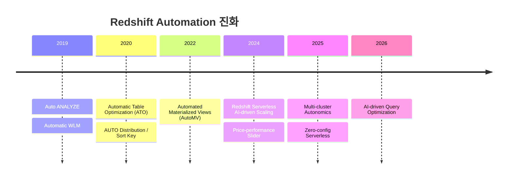

**AUTO Distribution Style** (Default):
- 작은 Table은 ALL Distribution, 데이터가 커지면 자동으로 KEY 또는 EVEN으로 전환
- ATO가 Query Pattern을 지속적으로 분석하여 Distribution Strategy를 재조정
- 30TB Dataset 기준 수동 Tuning 대비 **~24% Performance 개선** 달성 (AWS 내부 Benchmark)

**AUTO Sort Key** (Default):
- Filter/JOIN Predicate에 자주 등장하는 Column을 자동으로 Sort Key로 지정
- Workload 변화에 따라 동적으로 Sort Key를 재조정
- Background에서 실행되어 User Query에 영향 없음

**Automatic WLM** (Default):
- ML이 Query 특성을 분석하여 Memory와 Concurrency를 자동 조정
- Heavy Query는 낮은 Concurrency + 많은 Memory, Light Query는 높은 Concurrency
- Short Query Acceleration (SQA)으로 경량 Query 우선 처리

**Automated Materialized View (AutoMV)**:
- ML이 Workload를 분석하여 Materialized View를 자동 생성/유지/삭제
- Cost-benefit Analysis로 실제 효과가 있는 View만 유지
- Database당 최대 200개

### 그래도 남아 있는 Gap

자동화가 많이 진전되었지만, **Zero-config를 지향하는 BigQuery와 동일 수준은 아직 아니다.**

| 영역 | BigQuery | Redshift Serverless (2026) | Redshift Provisioned |
|------|----------|---------------------------|---------------------|
| Data Distribution | 개념 자체가 없음 | AUTO (권장 Default) | AUTO 또는 수동 |
| Sort/Ordering | Clustering (자동 권장) | AUTO (ATO 관리) | AUTO 또는 수동 |
| Workload Management | 완전 자동 | 완전 자동 | Automatic (Default) 또는 수동 |
| Scaling | 완전 자동 | AI-driven 자동 | 수동 판단 필요 |
| VACUUM | 불필요 | 대부분 자동 | 대부분 자동 |
| Statistics Update | 완전 자동 | 대부분 자동 | 대부분 자동 |
| **DBA 부담 수준** | **Near-zero** | **Low (~15%)** | **Moderate (~30%)** |

### 주의해야 할 함정들

Redshift Auto Tuning에 대해 알아야 할 현실적인 제약:

1. **명시적으로 지정한 Key는 ATO가 건드리지 않는다**: 기존 Table에 `DISTKEY(user_id)`를 수동 지정했다면, ATO가 더 나은 Key를 발견해도 변경하지 않는다. Legacy Table이 많은 조직은 이 함정에 빠지기 쉽다.

2. **Table Swap 시 최적화 History가 초기화된다**: Blue-Green Deployment 등에서 Table을 Swap하면 ATO가 새 Table을 처음부터 학습해야 한다.

3. **충분한 Query Volume이 있어야 학습한다**: Query가 적은 개발 환경에서는 ATO 효과가 미미하다. Production 수준의 Traffic이 필요하다.

4. **Advisor 권장 ≠ 최적**: Redshift Advisor가 변경을 제안하지 않아도 현재 상태가 최적이라는 의미는 아니다. 수동 EXPLAIN 분석이 여전히 가치 있다.

### 결론: Serverless를 쓰면 Gap은 줄어든다

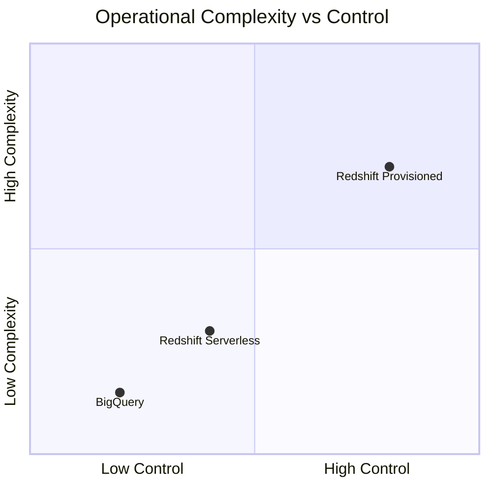

**Redshift Serverless + AUTO 전략**을 채택하면 BigQuery에 근접한 운영 경험을 얻을 수 있다. 하지만 "근접"이지 "동일"은 아니다.

- BigQuery는 **Distribution이라는 개념 자체가 없다**. 사용자가 잘못된 선택을 할 수 있는 여지가 원천 차단된다.
- Redshift는 AUTO가 Default이지만, **수동 개입의 여지가 항상 존재한다**. 이것이 장점(Fine-tuning 가능)이자 단점(잘못 건드리면 악화)이다.

팀에 전문 DBA가 없고, 최소한의 운영 부담을 원한다면 BigQuery가 여전히 더 안전한 선택이다. 반면 AWS Ecosystem에 묶여 있다면, **Redshift Serverless + 모든 설정 AUTO**로 시작하여, Bottleneck이 발견될 때만 수동 개입하는 전략이 현실적이다.

---

## 14. Console & Developer Experience

기술 선택만큼 중요한 것이 **매일 사용하는 Console의 경험**이다. Query를 작성하고, 결과를 확인하고, 비용을 관리하는 일상적 워크플로우에서 두 서비스는 뚜렷한 차이를 보인다.

### BigQuery Console (BigQuery Studio)

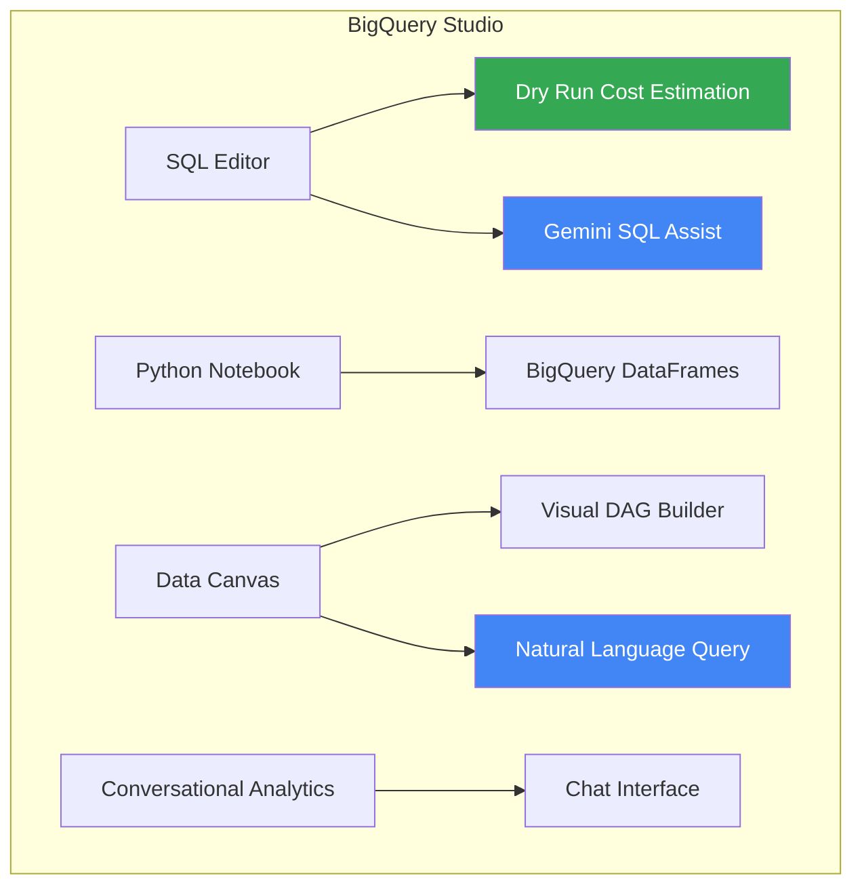

**핵심 강점: 실행 전 비용 확인**

BigQuery Console의 가장 강력한 UX Feature는 **Dry Run**이다. Query를 작성하면 실행하기 전에 Scan할 데이터 양과 예상 비용을 즉시 보여준다. On-Demand Pricing에서 이 기능은 실수로 수백 달러를 쓰는 사고를 원천 방지한다.

**주요 Feature**:

| Feature | 설명 |
|---------|------|
| **Dry Run** | Query 실행 전 Scan량/비용 자동 표시. 무료 |
| **Gemini SQL Assist** | AI 기반 SQL Autocomplete, 자연어 → SQL 변환 |
| **Data Canvas** | Gemini 기반 Visual Query Builder. DAG로 Workflow 시각화 |
| **Conversational Analytics** | Chat Interface로 자연어 데이터 분석 (2026.01 Preview 전면 공개) |
| **BigQuery Studio Notebook** | SQL + Python을 같은 Interface에서 실행. Colab Enterprise 기반 |
| **Scheduled Query** | Console에서 직접 Cron-like Query Scheduling |
| **Query History** | INFORMATION_SCHEMA.JOBS로 6개월간 보관 |
| **Looker Studio 연동** | Query 결과에서 바로 Visualization 생성 |

**Conversational Analytics (2026년 1월 Preview 전면 공개)**:
- 더 이상 Allowlist 없이 누구나 사용 가능
- 최신 Gemini Model 기반, Multi-turn 대화로 데이터 분석
- SQL/Python Code + Chart + Text를 함께 생성
- Verified Query로 Business Logic 반영 가능

### Redshift Console (Query Editor v2 + SageMaker Unified Studio)

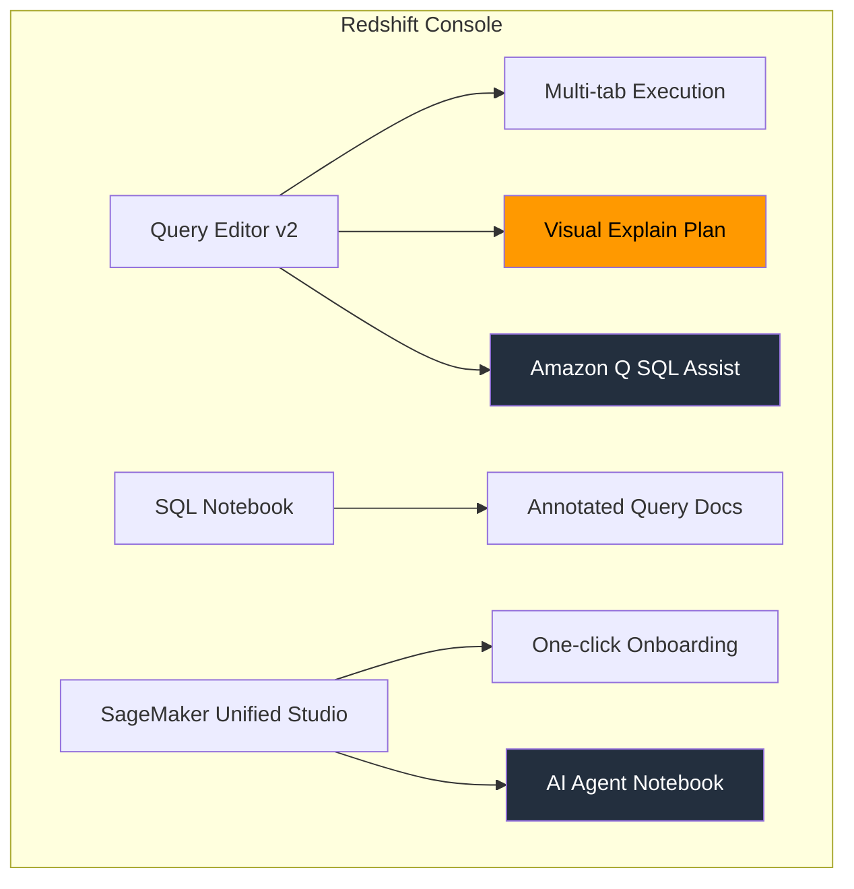

**핵심 강점: Visual Explain Plan**

Redshift Query Editor v2의 **Explain Graph**는 Query Execution Plan을 시각적으로 보여준다. Distribution Key 기반의 Data Redistribution, Sort Key 활용 여부, Scan 범위를 한눈에 파악할 수 있어, Performance Tuning에 직접적으로 도움된다.

BigQuery도 **Execution Graph**를 제공하지만 Stage 단위의 시각화인 반면, Redshift는 Node/Slice 수준의 물리적 실행 경로까지 보여주므로 Tuning 관점에서는 Redshift가 더 상세하다.

**주요 Feature**:

| Feature | 설명 |
|---------|------|
| **Query Editor v2** | Multi-tab, Autocomplete, Concurrent Execution |
| **Visual Explain Plan** | Query Execution Plan을 Graph로 시각화 |
| **Amazon Q Generative SQL** | 자연어 → SQL 변환 (2025.02 Seoul Region 지원) |
| **SQL Notebook** | Query + Annotation 결합. .ipynb Format Export |
| **Chart Wizard** | Query 결과에서 Histogram, Bar, Area Chart 생성 |
| **Glue Data Catalog** | External Table 자동 Mounting, 별도 Schema 생성 불필요 |
| **SageMaker Unified Studio** | ML + Analytics 통합 환경. AI Agent 내장 (2025.11) |
| **Monitoring Dashboard** | RPU 사용량, Query Runtime, Connection 수 실시간 확인 |

**SageMaker Unified Studio (2025년 하반기)**:
- One-click Onboarding: Redshift, Athena, S3에서 바로 진입
- AI Agent가 내장된 Notebook: 자연어로 Code/SQL 생성
- SQL → Python으로 자연스럽게 전환하며 ML Model까지 개발
- Trusted Identity Propagation으로 Cross-service SSO

### Console Experience 직접 비교

| 영역 | BigQuery Studio | Redshift Query Editor v2 |
|------|----------------|--------------------------|
| **비용 가시성** | ✅ Dry Run으로 실행 전 비용 표시 | ❌ 사전 비용 추정 없음 |
| **AI SQL Assist** | Gemini (BigQuery 전용) | Amazon Q (Preview, Region 제한) |
| **자연어 분석** | Conversational Analytics (전면 공개) | Amazon Q SQL (Preview) |
| **Execution Plan 시각화** | ✅ Execution Graph (Stage별 시각화) | ✅ Visual Explain Graph (Node/Slice별) |
| **Notebook** | SQL + Python 통합 (Colab 기반) | SQL Notebook (.ipynb) |
| **Visual Query Builder** | Data Canvas (DAG 형태) | 없음 |
| **Visualization** | Looker Studio 연동 | Chart Wizard (기본) |
| **Onboarding 경험** | 즉시 시작 (Serverless) | Cluster 설정 또는 Serverless 선택 필요 |
| **Scheduled Query** | Console 내장 | EventBridge 또는 외부 도구 필요 |
| **Schema 탐색** | Explorer Panel + Preview | Glue Data Catalog 자동 Mounting |

### 각 Console이 빛나는 순간

**BigQuery Console이 더 나은 경우**:
- 처음 시작할 때 — 아무 설정 없이 바로 Query 실행
- 비용 민감한 Ad-hoc 분석 — Dry Run으로 실수 방지
- Data Analyst가 자연어로 분석하고 싶을 때 — Conversational Analytics
- SQL과 Python을 오가며 작업할 때 — BigQuery Studio Notebook

**Redshift Console이 더 나은 경우**:
- Query Performance Tuning — Visual Explain Plan으로 병목 즉시 파악
- AWS 서비스 통합 Workflow — Glue Catalog, SageMaker로 자연스럽게 전환
- ML Pipeline 구축 — SageMaker Unified Studio에서 분석부터 Model 배포까지 One-stop
- 여러 Cluster/Workgroup을 동시에 작업 — Multi-tab으로 각각 연결

### 알려진 Pain Point

**BigQuery Console**:
- Struct Column에서 Field 추가/삭제 시 Console/SQL로 불가. bq CLI 또는 API 필요
- 간혹 `INSERT INTO ... LIMIT 0`에서도 1TB Billing 되는 Bug 보고
- CTE가 많은 Complex Query에서 "Resources exceeded" Error 발생 가능

**Redshift Console**:
- Single Leader Node Bottleneck: Compute Node를 아무리 늘려도 Leader Node가 병목이 되면 Query Queuing 발생
- Serverless Cold Start: Traffic Burst 시 S3에서 데이터를 Fetch하는 I/O Overhead
- Python UDF: 2025.11 신규 생성 중단, **2026.06.30 기존 UDF 실행도 중단** 예정. Lambda UDF로 Migration 필요

---

## 15. 선택 가이드: 어떤 상황에서 무엇을 선택할 것인가

### BigQuery를 선택해야 하는 경우

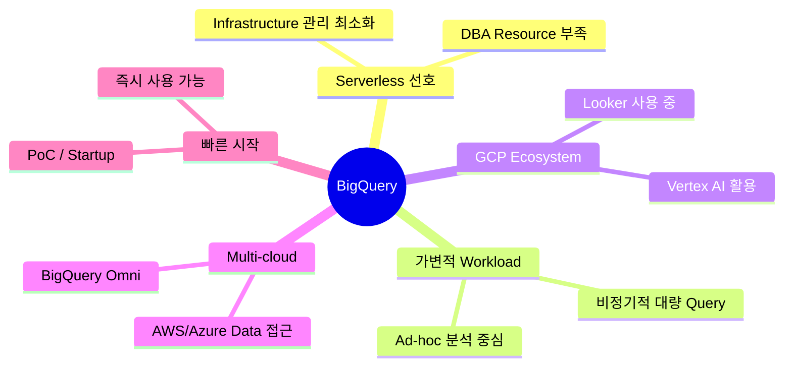

**구체적 Scenario**:
1. **Startup/중소 규모**: Infrastructure 관리 없이 바로 분석 시작. 종량제로 초기 비용 최소화
2. **DBA 없는 팀**: Distribution Key, Sort Key 개념 자체가 없으므로 운영 실수 원천 차단
3. **Data Science 팀**: BigQuery ML로 SQL 기반 ML. Vertex AI로 고급 Model 전환 용이
4. **비용 민감한 Ad-hoc 분석**: Dry Run으로 실행 전 비용 확인. 실수로 대형 Query를 날리는 사고 방지
5. **Multi-cloud 전략**: BigQuery Omni로 AWS/Azure Data를 단일 SQL로 분석
6. **Concurrent User가 많은 환경**: Auto Scaling으로 수백 명의 Analyst 동시 지원

### Redshift를 선택해야 하는 경우

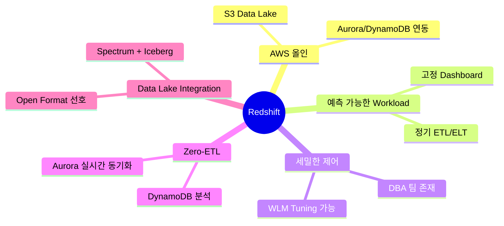

**구체적 Scenario**:
1. **AWS 중심 조직**: Zero-ETL로 Aurora/DynamoDB Data를 Pipeline 없이 분석
2. **전문 DBA가 있는 팀**: Distribution Key, Sort Key, WLM Tuning으로 극한 Performance 달성
3. **Performance Tuning이 핵심인 환경**: Visual Explain Plan으로 Bottleneck을 정밀 분석
4. **Data Lake 중심**: Spectrum + Iceberg로 S3 기반 Lakehouse Architecture 구현
5. **비용 예측이 중요한 기업**: Reserved Instance로 장기 비용을 정확히 예측
6. **DBA 없이 AWS에 묶인 경우**: Redshift Serverless + 모든 설정 AUTO로 시작, Bottleneck 시에만 수동 개입

---

## 마치며

BigQuery와 Redshift는 각각의 영역에서 최고 수준의 Cloud Data Warehouse다. 기술적 우열보다 중요한 것은 **조직의 맥락**이다.

**첫째, 기존 Cloud Ecosystem을 존중하라.** AWS를 주력으로 사용하는 조직이 BigQuery만을 위해 GCP를 도입하는 것은 운영 복잡성을 크게 높인다. 반대도 마찬가지다. Zero-ETL, Spectrum, BigQuery Omni 같은 기능들은 각자의 Ecosystem 안에서 빛을 발한다.

**둘째, 팀의 역량과 문화를 고려하라.** Redshift는 세밀한 Tuning으로 극한 Performance를 끌어낼 수 있지만, 그만큼 전문 인력이 필요하다. BigQuery는 Serverless Model로 운영 부담을 줄이지만, Fine-grained Control을 포기해야 한다.

**셋째, Workload Pattern을 분석하라.** 가변적이고 예측 불가능한 Pattern이면 BigQuery의 On-Demand가, 안정적이고 예측 가능한 Pattern이면 Redshift의 Reserved Instance가 비용 효율적이다.

**넷째, 운영 부담과 Developer Experience를 과소평가하지 마라.** Distribution Key를 잘못 선택하면 Performance가 급감하고, Dry Run 없이 Query를 실행하면 예상치 못한 비용이 발생한다. 이런 일상적 마찰은 장기적으로 팀의 생산성에 큰 영향을 미친다. BigQuery는 이 마찰을 원천 차단하는 설계이고, Redshift Serverless + AUTO는 마찰을 최소화하되 완전히 제거하지는 못한다.

어느 쪽을 선택하든, 결국 중요한 것은 **데이터로부터 가치를 얼마나 빠르고 안정적으로 뽑아내느냐**이다. 이 글이 그 판단에 도움이 되기를 바란다.

---

## References

- [Inside Capacitor, BigQuery's next-generation columnar storage format](https://cloud.google.com/blog/products/bigquery/inside-capacitor-bigquerys-next-generation-columnar-storage-format)
- [BigQuery pricing](https://cloud.google.com/bigquery/pricing)
- [Amazon Redshift pricing](https://aws.amazon.com/redshift/pricing/)
- [BigQuery vs Redshift: A comprehensive comparison in 2025](https://www.eesel.ai/blog/bigquery-vs-redshift)
- [Redshift vs BigQuery: Cloud Data Warehouse Comparison 2026](https://www.luzmo.com/blog/bigquery-vs-redshift)
- [BigQuery vs. Redshift Comparison: 2026 Deep-Dive](https://portable.io/learn/bigquery-vs-redshift-comparison)
- [Amazon Redshift zero-ETL integrations](https://docs.aws.amazon.com/redshift/latest/mgmt/zero-etl-using.html)
- [Introduction to BigQuery Omni](https://docs.cloud.google.com/bigquery/docs/omni-introduction)
- [BigQuery ML documentation](https://cloud.google.com/bigquery/docs/bqml-introduction)
- [Amazon Redshift ML](https://docs.aws.amazon.com/redshift/latest/dg/machine_learning.html)
- [Automatic table optimization - Amazon Redshift](https://docs.aws.amazon.com/redshift/latest/dg/t_Creating_tables.html)
- [Implementing automatic WLM - Amazon Redshift](https://docs.aws.amazon.com/redshift/latest/dg/automatic-wlm.html)
- [Amazon Redshift Serverless AI-driven scaling and optimization](https://aws.amazon.com/about-aws/whats-new/2024/10/amazon-redshift-serverless-ai-driven-scaling-optimization/)
- [Amazon Redshift autonomics for multi-cluster environments](https://aws.amazon.com/about-aws/whats-new/2026/02/amazon-redshift-autonomics-for-multi-cluster/)
- [Conversational Analytics in BigQuery](https://cloud.google.com/blog/products/data-analytics/introducing-conversational-analytics-in-bigquery)
- [BigQuery Data Canvas](https://cloud.google.com/blog/products/data-analytics/exploring-new-bigquery-data-canvas-ai-assistant-features/)
- [Amazon Q generative SQL for Amazon Redshift](https://aws.amazon.com/blogs/big-data/write-queries-faster-with-amazon-q-generative-sql-for-amazon-redshift/)
- [SageMaker Unified Studio notebooks with AI agent](https://aws.amazon.com/blogs/aws/new-one-click-onboarding-and-notebooks-with-ai-agent-in-amazon-sagemaker-unified-studio/)
- [Estimate and control costs - BigQuery](https://cloud.google.com/bigquery/docs/best-practices-costs)
- [Jupiter network: 13 Petabits/sec](https://cloud.google.com/blog/products/networking/speed-scale-reliability-25-years-of-data-center-networking)
- [Query plan and timeline - BigQuery](https://cloud.google.com/bigquery/docs/query-plan-explanation)
- [DC2 End-of-Life notice - Amazon Redshift](https://docs.aws.amazon.com/redshift/latest/mgmt/dc2-eol.html)
- [Amazon Data Firehose (formerly Kinesis Data Firehose)](https://aws.amazon.com/about-aws/whats-new/2024/02/amazon-data-firehose-formerly-kinesis-data-firehose/)
- [Zero-ETL latency characteristics](https://docs.aws.amazon.com/redshift/latest/mgmt/zero-etl-using.html)
- [Redshift encryption at rest (default since 2019)](https://docs.aws.amazon.com/redshift/latest/mgmt/working-with-db-encryption.html)
- [Python UDF end of support (June 2026)](https://aws.amazon.com/blogs/big-data/amazon-redshift-python-user-defined-functions-will-reach-end-of-support-after-june-30-2026/)
