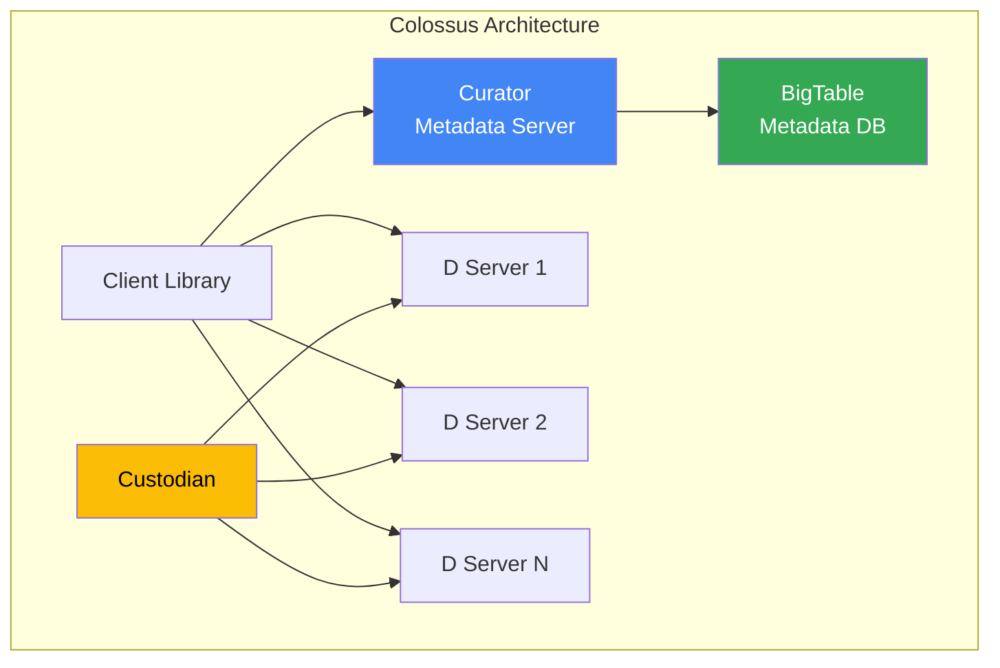
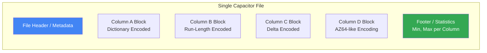
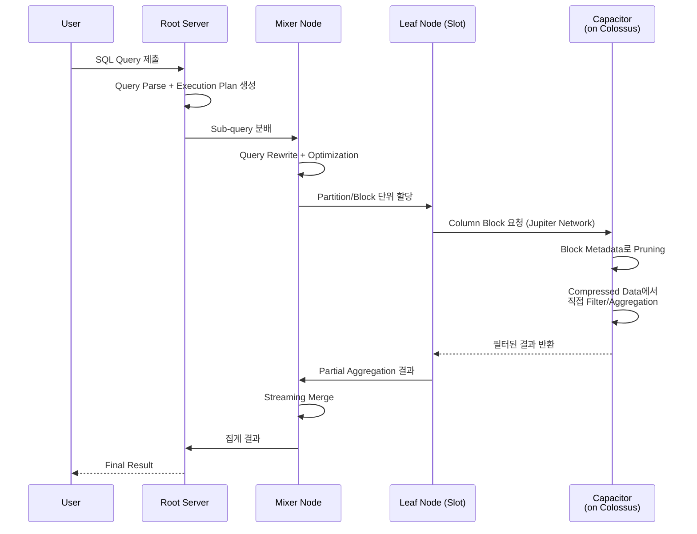

## 들어가며

BigQuery의 Performance는 단순히 좋은 Query Engine 하나로 만들어지지 않았다. 그 아래에는 Google이 20년 넘게 진화시켜 온 Infrastructure Stack이 있다.

- **Colossus**: Exabyte 규모의 Distributed File System
- **Capacitor**: Compressed 상태에서 직접 Query할 수 있는 Columnar Format
- **Jupiter**: 13 Petabits/sec Bandwidth의 Data Center Network
- **Dremel**: Tree 구조 병렬 Execution Engine
- **Borg**: 수만 대 Machine의 Cluster Management System

이 글에서는 이 중 **Colossus와 Capacitor**에 집중한다. BigQuery에서 Query를 실행하면, 실제 데이터는 어디에 어떻게 저장되어 있고, 어떤 원리로 읽히는지 구조적으로 살펴본다.

---

## 1. GFS에서 Colossus로: 20년의 진화

### GFS (2003)

Google File System은 2003년 논문으로 공개되었다. 핵심 설계 결정은 다음과 같았다:

- **Single Master**: 하나의 Master Node가 모든 Metadata를 Memory에 보관
- **64MB Chunk**: 대용량 파일을 64MB 단위로 분할하여 Chunk Server에 분산
- **3-way Replication**: 모든 Chunk를 3개 복제본으로 유지

이 설계는 수백 TB 규모에서는 잘 동작했지만, Petabyte를 넘어서자 **Single Master가 Bottleneck**이 되었다. Master의 Memory가 데이터 양에 비례하여 선형 증가했기 때문이다.

### Colossus (2010~)

Colossus는 GFS의 Single Master 문제를 근본적으로 해결한 후속 시스템이다.

**5개 핵심 Component**:

| Component | 역할 |
|-----------|------|
| **Client Library** | Application별 Software RAID 구현. Latency/Availability/Cost Tradeoff 제어 |
| **Curator** | Metadata Server. 파일 생성 등 Control Plane 담당. 수평 확장 가능 |
| **BigTable** | Metadata 저장소. 각 Row가 하나의 파일 Metadata에 대응 |
| **D Server** | Data Server (Disk). Client와 직접 RDMA-like Protocol로 통신하는 Block Server |
| **Custodian** | Background Storage Manager. Disk Balancing, RAID Reconstruction, Hot/Cold 전환 |

**GFS 대비 핵심 개선**:

| 구분 | GFS | Colossus |
|------|-----|----------|
| Metadata | Single Master (Memory) | 분산 Curator + BigTable |
| Scale | 수백 TB ~ 수 PB | **Exabyte** (100배 이상) |
| Replication | 3-way (3x Overhead) | **Reed-Solomon RS(6,3)** (1.5x Overhead) |
| 가용성 | Master 장애 시 전체 영향 | Curator 수평 확장, Single Point of Failure 없음 |

### Reed-Solomon Erasure Coding

Colossus는 3-way Replication 대신 **RS(6,3)** Erasure Coding을 사용한다.

- 6개 Data Block + 3개 Parity Block으로 구성
- **임의의 3개 Block이 손실되어도 전체 데이터 복구 가능**
- Storage Overhead: **1.5x** (3-way Replication의 3x 대비 절반)
- 같은 수준의 Fault Tolerance를 절반의 Storage로 달성

### Colossus의 현재 성능 (2024-2025)

Google Cloud Blog에서 공개한 Rapid Storage on Colossus 수치:

| 지표 | 수치 |
|------|------|
| Request 처리 | **2,000만 req/sec** |
| Throughput | **6 TB/sec** |
| Durability | Zone 내 **11 nines** |
| Availability | **3 nines** |
| Random Read Latency | Sub-millisecond |

Google의 거의 모든 서비스(YouTube, Gmail, Google Drive, BigQuery, Cloud Storage)가 Colossus 위에서 동작한다.

---

## 2. Capacitor: BigQuery의 Columnar Format

### ColumnIO에서 Capacitor로

BigQuery 초기에는 **ColumnIO**라는 Columnar Format을 사용했다. ColumnIO는 Dremel 논문(2010)에서 소개된 Repetition Level / Definition Level 기반의 Nested Data 처리를 지원했으나, Colossus와의 Disaggregated Storage 환경에서 최적화에 한계가 있었다.

2014년부터 Migration이 시작된 **Capacitor**는 ColumnIO의 근본적인 재설계다:

- 임의 깊이의 Recursive Message Type 지원
- Storage Layer에 **Mini Query Processor** 내장
- **Compressed 상태에서 직접 Query** 가능
- Row Reordering으로 Compression 효율 극대화

### Capacitor의 파일 구조

**핵심 특징**:

1. **Single File, Multiple Column Blocks**: 모든 Column이 하나의 Capacitor 파일 내 독립적인 Block으로 저장된다. Parquet처럼 Column별 별도 파일이 아니라, 단일 파일 내에서 Column Block이 분리된 구조다.

2. **독립적 Compression**: 각 Column Block은 독립적으로 Compress된다. String Column은 Dictionary Encoding, Timestamp는 Delta Encoding, Boolean은 Bit-Vector 등 Column 특성에 맞는 최적 Encoding이 자동 적용된다.

3. **Block Metadata (Statistics)**: 각 Block의 Min/Max 값, Row Count 등 통계를 Footer에 저장한다. Query 시 이 Metadata만 읽어 Block Pruning을 수행할 수 있다.

### Compression 없이 Query하는 원리

Capacitor의 가장 독특한 혁신은 **Compressed Data를 Decompress하지 않고 직접 Query하는 능력**이다.

일반적인 Columnar Format(Parquet, ORC 등)에서는:
1. Disk에서 Compressed Block 읽기
2. Memory에서 Decompress
3. Decompressed Data에 대해 Filter/Aggregation 수행

Capacitor에서는:
1. Disk에서 Compressed Block 읽기
2. **Compressed 상태 그대로** Filter/Aggregation 수행

이것이 가능한 이유는 Capacitor에 내장된 **Mini Query Processor**가 각 Encoding 방식에 맞는 Predicate Evaluation을 직접 수행하기 때문이다. 예를 들어 Dictionary Encoded Column에서 `WHERE status = 'active'`를 평가할 때, Dictionary에서 'active'의 Code를 찾고, Compressed Code Array에서 직접 매칭한다.

### Row Reordering: NP-Complete 문제의 근사 해법

분석 Table에서 Row 순서는 보통 의미가 없다. Capacitor는 이 점을 활용하여 **Compression 효율을 극대화하는 방향으로 Row를 재배치**한다.

**문제**: 최적의 Row 순서를 찾는 것은 **NP-Complete** 문제다 (Traveling Salesman Problem과 유사).

**해법**: Capacitor는 Approximation Algorithm을 사용하여 합리적인 시간 내에 근사 해를 찾는다.

**실측 결과** (Google 내부 40개 Dataset):
- 평균 **17% Storage 절감**
- 일부 Dataset에서 **최대 40% 절감**
- 극단적 경우 **75%까지 절감**

Run-Length Encoding은 같은 값이 연속될 때 효과적이므로, 비슷한 값의 Row를 인접하게 배치하면 RLE 구간이 길어져 Compression 효율이 크게 개선된다.

### Encoding 종류

| Encoding | 적합한 데이터 | 원리 |
|----------|-------------|------|
| **Dictionary** | 반복 값이 많은 String | Unique 값을 한 번만 저장하고 Index로 참조 |
| **Run-Length (RLE)** | 연속 반복 값 | 값 + 반복 횟수로 압축. Row Reordering과 시너지 |
| **Delta** | Timestamp, Sequential Integer | 연속 값 간 차이만 저장. Timestamp에 특히 효과적 |
| **Bit-Vector** | Boolean, Low Cardinality | Bit 단위로 값 표현 |
| **Integer Delta** | 정수 Column | 정수 전용 최적화된 Delta Encoding |
| **Float XOR** | 부동소수점 | 연속 값의 XOR 차이를 Bit-packing |

Capacitor는 데이터 특성을 분석하여 **자동으로 최적 Encoding을 선택**한다. 사용자가 개입할 필요가 없다.

### Capacitor vs Parquet vs ORC

| 구분 | Capacitor | Parquet | ORC |
|------|-----------|---------|-----|
| 용도 | BigQuery 전용 | Spark/Hadoop Ecosystem | Hive Ecosystem |
| 파일 구조 | Single File, Multi-Column Block | Multi-Row Group, Multi-Column Chunk | Stripe 기반 |
| Compressed Query | **지원** (Mini Query Processor) | 미지원 | 미지원 |
| Row Reordering | **자동** (Approximation Algorithm) | 미지원 | 미지원 |
| Nested Data | Repetition/Definition Level | Repetition/Definition Level (Dremel 차용) | Struct/List/Map |
| Block Metadata | Min/Max, Statistics | Min/Max, Statistics, Bloom Filter | Min/Max, Bloom Filter, Index |
| Open Format | ❌ (BigQuery 전용) | ✅ | ✅ |

Parquet의 Nested Data 처리 방식(Repetition/Definition Level)은 사실 Google의 Dremel 논문에서 차용한 것이다. Capacitor는 이 기반 위에 Compressed Query와 Row Reordering이라는 독자적 혁신을 추가했다.

---

## 3. Colossus + Capacitor + Jupiter + Dremel: 데이터 흐름

BigQuery에서 Query를 실행하면 실제로 어떤 일이 벌어지는가?

**각 단계의 핵심 최적화**:

1. **Root Server**: Hybrid Optimizer (Rule-based + Cost-based)로 Execution Plan 생성

2. **Mixer**: Sub-query로 분해하면서 **Predicate Pushdown**, **Join Reordering** 적용

3. **Leaf Node (Slot)**:
   - Borg가 할당한 Compute Resource
   - Colossus D Server에서 Jupiter Network를 통해 데이터 직접 읽기
   - RDMA-like Protocol로 Low Latency 통신

4. **Capacitor (on Colossus)**:
   - **Partition Pruning**: 필요한 Partition만 선택
   - **Block Pruning**: Min/Max Metadata로 불필요한 Block 건너뜀
   - **Compressed Query**: Decompress 없이 Filter/Aggregation
   - **Column Pruning**: SELECT에 명시된 Column Block만 읽기

5. **Shuffle**: Leaf → Mixer 간 중간 결과 전달. Jupiter Network의 13 Pb/s Bandwidth 활용. In-memory Operation으로 수행

---

## 4. Borg의 역할: Slot 할당

BigQuery에서 "Slot"은 가상 CPU 단위라고 설명되지만, 실제로는 **Borg가 관리하는 Dremel Leaf Node의 Execution Thread**다.

### Slot Allocation 과정

1. Query가 들어오면 Dremel Query Dispatcher가 필요한 Slot 수를 계산
2. Borg에 Compute Resource 요청
3. Borg가 Cluster에서 가용한 Machine을 찾아 Slot 할당
4. Query 완료 후 Slot 즉시 반환

### Fair Scheduling

- 같은 Reservation 내의 Project들이 Slot을 **균등하게 공유**
- 활성 Query가 줄면 남은 Query에 Slot이 자동으로 재배분
- On-Demand Mode에서는 Project당 최대 **2,000 Concurrent Slot** (Burst 가능)

이 구조 덕분에 사용자는 Infrastructure를 전혀 인식하지 않는다. "어디서 몇 대의 Machine이 내 Query를 처리하는지"를 알 필요도, 관리할 필요도 없다.

---

## 마치며

BigQuery의 "Serverless"라는 말 뒤에는 20년간 진화한 거대한 Infrastructure가 있다.

- **Colossus**는 Exabyte 규모의 데이터를 1.5x Storage Overhead로 저장하며, Sub-millisecond Latency로 읽기를 제공한다.
- **Capacitor**는 데이터를 자동으로 최적 Encoding하고, Row를 재배치하여 Compression을 극대화하며, Compressed 상태에서 직접 Query할 수 있게 한다.
- **Jupiter**가 13 Pb/s Bandwidth로 둘 사이를 연결하고, **Dremel**이 수천 개 Slot으로 Query를 병렬 실행하며, **Borg**가 이 모든 것을 조율한다.

사용자가 SQL 한 줄을 실행할 때, 이 다섯 시스템이 동시에 동작하여 Terabyte 규모의 데이터를 수 초 안에 처리한다. 이것이 BigQuery가 Distribution Key도, Sort Key도, Cluster Sizing도 요구하지 않는 이유다 — 그 복잡성을 Infrastructure가 흡수하고 있기 때문이다.

---

## References

- [A peek behind Colossus, Google's file system](https://cloud.google.com/blog/products/storage-data-transfer/a-peek-behind-colossus-googles-file-system)
- [Inside Capacitor, BigQuery's next-generation columnar storage format](https://cloud.google.com/blog/products/bigquery/inside-capacitor-bigquerys-next-generation-columnar-storage-format)
- [Factors influencing BigQuery compression ratios](https://cloud.google.com/blog/products/data-analytics/factors-influencing-bigquery-compression-ratios)
- [BigQuery under the hood](https://cloud.google.com/blog/products/bigquery/bigquery-under-the-hood)
- [Separation of storage and compute in BigQuery](https://cloud.google.com/blog/products/bigquery/separation-of-storage-and-compute-in-bigquery)
- [Jupiter now scales to 13 Petabits per second](https://cloud.google.com/blog/products/networking/speed-scale-reliability-25-years-of-data-center-networking)
- [Dremel: A Decade of Interactive SQL Analysis at Web Scale (VLDB 2020)](https://www.vldb.org/pvldb/vol13/p3461-melnik.pdf)
- [Large-scale cluster management at Google with Borg](https://research.google/pubs/pub43438/)
- [Life of a BigQuery streaming insert](https://cloud.google.com/blog/products/bigquery/life-of-a-bigquery-streaming-insert)
- [How Colossus optimizes data placement for performance](https://cloud.google.com/blog/products/storage-data-transfer/how-colossus-optimizes-data-placement-for-performance)
- [BigQuery Admin reference guide: Storage internals](https://cloud.google.com/blog/topics/developers-practitioners/bigquery-admin-reference-guide-storage)
