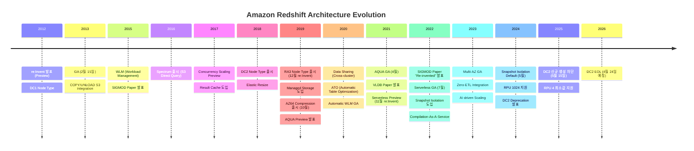
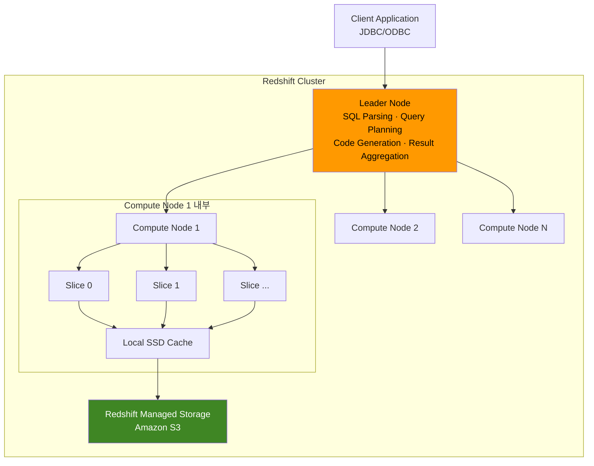
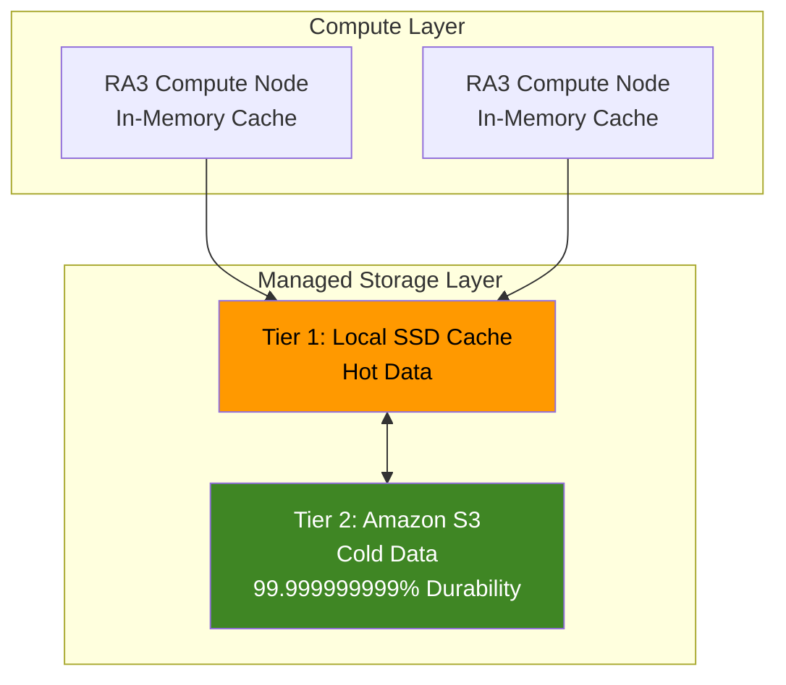
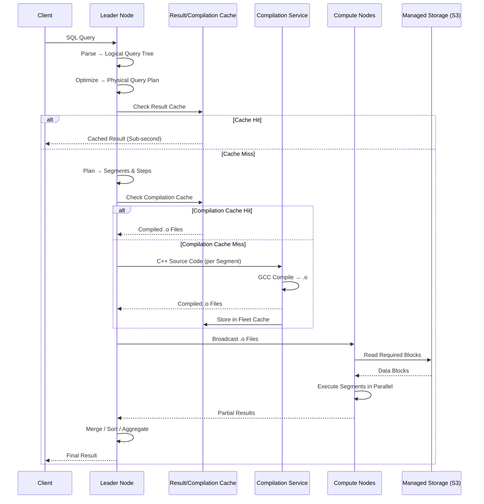
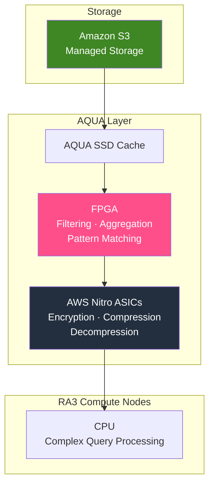
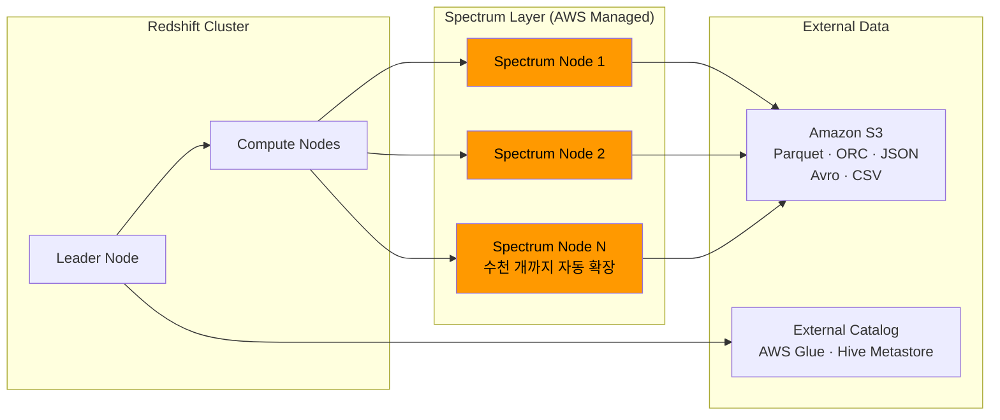
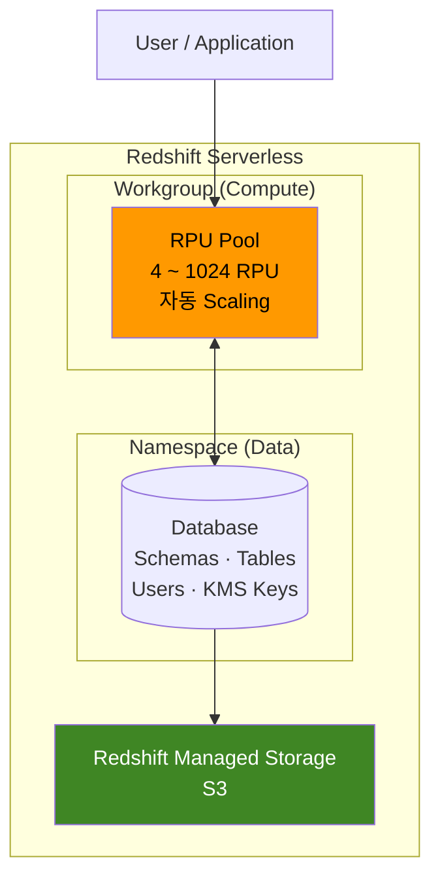
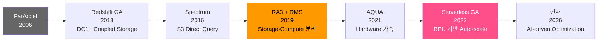

## 용어 사전

이 글에서 자주 등장하는 핵심 용어를 먼저 정리한다.

| 용어 | 설명 |
|------|------|
| **MPP** (Massively Parallel Processing) | 다수의 Node가 Query를 분할하여 동시에 처리하는 Architecture |
| **Leader Node** | Client 요청을 받아 SQL Parsing, Query Planning, Code Generation을 수행하고 결과를 집계하는 Coordinator |
| **Compute Node** | 실제 데이터를 저장하고 Query Segment를 병렬 실행하는 Worker Node |
| **Slice** | Compute Node 내부의 병렬 처리 단위. 독립적인 CPU, Memory, Disk Partition을 가짐 |
| **RMS** (Redshift Managed Storage) | S3 기반 Tiered Storage. Local SSD Cache + S3 Cold Storage로 구성 |
| **AQUA** (Advanced Query Accelerator) | Storage Layer에서 FPGA/Nitro Processor로 Filtering과 Aggregation을 사전 수행하는 가속기 |
| **Zone Map** | 각 1MB Block의 Min/Max 값을 Memory에 보관하는 Metadata. Block Skipping에 사용 |
| **AZ64** | Amazon이 자체 개발한 SIMD 기반 Compression Algorithm. Numeric/Date Type에 특화 |
| **WLM** (Workload Management) | Query Queue별 Memory, Concurrency Slot을 배분하는 Resource Management 시스템 |
| **ATO** (Automatic Table Optimization) | Query Pattern을 분석하여 Distribution Key/Sort Key를 자동 최적화하는 AI 기반 기능 |
| **RPU** (Redshift Processing Unit) | Redshift Serverless의 Compute 단위. 1 RPU = 16GB Memory |
| **Concurrency Scaling** | Workload 급증 시 Transient Cluster를 자동 추가하여 Throughput을 확장하는 기능 |
| **SQA** (Short Query Acceleration) | 짧은 Query를 전용 Queue(Service Class 14)에서 우선 실행하여 긴 Query에 Block되지 않게 하는 기능 |
| **MVCC** (Multi-Version Concurrency Control) | 각 Transaction이 데이터의 Snapshot을 기반으로 동작하여 Read/Write Blocking을 최소화하는 동시성 제어 |

---

## 들어가며

Amazon Redshift는 2012년 re:Invent에서 발표되어 2013년 2월 15일 GA(General Availability)된 이후, Cloud Data Warehouse 시장의 판도를 바꾸어 놓았다. 2025년 기준 수만 개의 조직이 Petabyte 규모의 데이터를 Redshift 위에서 분석하고 있다.

그러나 Redshift의 내부 동작을 체계적으로 이해하는 글은 의외로 드물다. 대부분의 자료가 사용법에 집중하고, Architecture를 다루더라도 표면적인 수준에 머무른다.

이 글에서는 Redshift의 **기원부터 최신 Serverless Architecture까지**, 12개 영역을 기술적으로 살펴본다. 주요 Reference는 다음과 같다:

- **SIGMOD 2015**: "Amazon Redshift and the Case for Simpler Data Warehouses"
- **VLDB 2021**: "The Evolution of Amazon Redshift" (Ippokratis Pandis)
- **SIGMOD 2022**: "Amazon Redshift Re-invented"
- **CMU 15-721 (Spring 2024)**: System Analysis - Amazon Redshift
- **AWS 공식 문서 및 Blog**

> BigQuery와의 비교는 ["BigQuery vs Redshift: Cloud Data Warehouse 선택을 위한 비교"](/post/2026/02/08/bigquery-vs-redshift-deep-dive-ko/)에서 다룬다. BigQuery의 내부 Storage 구조는 ["Colossus와 Capacitor: BigQuery를 지탱하는 Storage의 구조"](/post/2026/02/08/colossus-capacitor-bigquery-internals-ko/)를 참고한다.

---

## 1. 역사적 진화: ParAccel에서 Serverless까지

### ParAccel 기원 (2006~2012)

ParAccel은 2006년 **Barry Zane**과 **Tom Clancey**가 설립한 MPP 분석 Database 회사다. ParAccel Analytic Database(PADB)는 다음 특성을 가졌다:

- **Shared-Nothing MPP Architecture**
- **Columnar Storage** 기반
- **PostgreSQL 8.0.2 Wire Protocol** 호환 (SQL Dialect은 크게 변형)
- Adaptive Compression과 Memory-centric 설계

> **주의**: Redshift는 "PostgreSQL Fork"라고 자주 오해받지만, ParAccel은 PostgreSQL의 **Wire Protocol과 일부 System Catalog 구조**만 차용했을 뿐, Storage Engine, Query Executor, Optimizer는 완전히 독자 구현이다. PostgreSQL의 Row-based Storage Engine은 전혀 사용하지 않는다.

Amazon은 2011년 7월 ParAccel의 Funding Round에 참여하여 지분을 확보했고, 이를 기반으로 Redshift를 개발했다. ParAccel 자체는 이후 2013년에 Actian Corporation에 인수되었다.

### Architecture 진화 Timeline



핵심 전환점은 3가지다:

1. **2019년 RA3 + Managed Storage**: Compute와 Storage의 분리. Redshift Architecture의 가장 큰 패러다임 전환
2. **2021년 AQUA**: Storage Layer에서 Compute를 수행하는 Push-down Processing
3. **2022년 Serverless GA**: Infrastructure 관리 없이 RPU 기반으로 Scale하는 새로운 소비 모델

---

## 2. Node Architecture

### 전체 구조



### Leader Node

Leader Node는 Client와의 유일한 접점이며 다음을 수행한다:

1. **SQL Parsing**: SQL 문을 받아 Logical Query Tree로 변환
2. **Query Optimization**: Table Statistics(Row 수, Column Cardinality, Data Distribution)를 기반으로 Join 순서, Predicate Selectivity, Distribution 전략을 결정
3. **Code Generation**: 최적화된 Plan을 C++ 코드로 변환 (Segment 단위)
4. **Compilation**: GCC(GNU Compiler Collection)로 `.o` Object File을 생성
5. **Distribution**: Compiled Code를 Compute Node들에 Broadcasting
6. **Result Aggregation**: Compute Node에서 반환된 Partial Result를 Merge, Sort, Aggregate하여 최종 결과 생성
7. **Result Caching**: 결과를 Leader Node Memory에 Cache하여 동일 Query 재실행 시 Compute Node를 거치지 않음

> Leader Node는 Compute Node와 **동일한 Node Type**을 사용한다. 별도 과금되지 않지만, Resource를 소비하므로 단일 노드 Cluster에서는 Leader가 Compute도 겸한다.

### Compute Node와 Slice

각 Compute Node는 여러 개의 **Slice**로 나뉜다. Slice는 Redshift에서 가장 작은 병렬 처리 단위이며, 각각 독립적인 CPU Core, Memory 영역, Disk Partition을 할당받는다.

데이터는 Distribution Style에 따라 Slice에 분배된다. Query 실행 시 각 Slice는 자신이 담당하는 데이터 범위에 대해 독립적으로 Segment를 실행한다.

### Node Type 상세 Specification

| Node Type | vCPU | Memory | Storage | Slices/Node | Node Range | Max Managed Storage |
|-----------|------|--------|---------|-------------|------------|---------------------|
| **DC2.large** | 2 | 15 GB | 160 GB NVMe-SSD | 2 | 1~32 | N/A (Local Only) |
| **DC2.8xlarge** | 32 | 244 GB | 2.56 TB NVMe-SSD | 16 | 2~128 | N/A (Local Only) |
| **RA3.xlplus** | 4 | 32 GB | 32 TB RMS | 2 | 2~324 | 1,024 TB |
| **RA3.4xlarge** | 12 | 96 GB | 64 TB RMS | 4 | 2~325 | 8,192 TB |
| **RA3.16xlarge** | 48 | 384 GB | 64 TB RMS | 16 | 2~128 | 16,384 TB |

> **DC1**: Dense Compute 1세대. 이미 EOL. **DS2**: Dense Storage. 2021년 EOL. **RA3.large**: 2024년 이후 일부 Region에서 지원 중단.

### DC2 End-of-Life 일정

DC2는 명확한 Deprecation Schedule이 발표되어 있다:

- **2025년 5월 15일**: DC2 신규 Cluster 생성, Resize, Node 추가 불가
- **2026년 4월 24일**: DC2 완전 EOL. 모든 DC2 Cluster는 Long Term Maintenance(LTM) Track으로 이관되며 Feature Development 중단 (Release P191 이후 동결)

Migration 경로는 **RA3** 또는 **Redshift Serverless**다.

---

## 3. Managed Storage (RMS)

### Architecture

RA3 Node Type과 함께 2019년 도입된 Redshift Managed Storage는 Redshift Architecture의 가장 중요한 전환점이다. Compute와 Storage를 **물리적으로 분리**하여 독립적으로 Scaling할 수 있게 되었다.



### Tiered Storage 동작 원리

RMS는 3-Tier 구조로 동작한다:

1. **Tier 0 - In-Memory Cache**: Compute Node의 DRAM. 가장 빈번하게 접근되는 Block
2. **Tier 1 - Local SSD Cache**: Compute Node에 장착된 NVMe SSD. Hot Data를 캐싱
3. **Tier 2 - Amazon S3**: 모든 데이터의 영구 저장소. 99.999999999%(11 Nines) Durability

### 자동 Data Tiering Algorithm

RMS는 다음 3가지 Signal을 기반으로 자동 Tiering을 수행한다:

- **Data Block Temperature**: 최근 접근 빈도. 자주 읽히는 Block은 SSD에 유지
- **Data Block Age**: Block 생성 시점. 오래된 Block은 점진적으로 S3로 Evict
- **Workload Patterns**: Query Pattern 분석. 특정 시간대에 집중적으로 사용되는 데이터를 사전에 Prefetch

Eviction과 Prefetch는 **Fine-grained**(Block 단위)으로 이루어지며, 사용자 개입 없이 자동으로 수행된다.

### Durability와 Commit Protocol

RMS는 최소 3개 Copy를 유지한다:

- Compute Node 원본
- Compute Node Replica
- S3 Backup

Incremental Commit Protocol을 사용하여 **마지막 Commit 이후 변경된 Block만** S3에 기록한다. 이는 Commit 비용을 크게 절감한다.

---

## 4. Storage Format과 Data Organization

### 1MB Immutable Block

Redshift는 데이터를 **1MB(1,048,576 bytes) 고정 크기의 Immutable Block**에 저장한다. 일반적인 RDBMS의 Block Size(2KB~32KB)에 비해 훨씬 크다. 이 설계 결정의 이점은:

- **Sequential I/O 최적화**: 1MB 단위 읽기는 SSD/S3 모두에서 효율적
- **Compression 효율**: 같은 Column의 더 많은 값이 하나의 Block에 모이므로 압축률이 높음
- **Zone Map 효과 극대화**: Block 내 값의 범위가 좁을수록 Skip Scanning이 효과적

각 Block은 **단일 Column의 데이터만** 포함한다. 즉, Column A의 값들은 Column B의 값들과 절대 같은 Block에 섞이지 않는다.

Block은 **Immutable**이다. UPDATE 시 기존 Block을 수정하지 않고, 기존 Row를 삭제 표시한 후 새 Row를 새 Block에 INSERT한다. 이것이 VACUUM이 필요한 근본적 이유다.

### Zone Map

Zone Map은 각 1MB Block에 대해 **최솟값(Min)과 최댓값(Max)**을 Memory에 보관하는 Metadata 구조다.

```
Block 0: [2024-01-01 ~ 2024-01-15] ← 1MB of date column
Block 1: [2024-01-16 ~ 2024-01-31]
Block 2: [2024-02-01 ~ 2024-02-14]
...
```

Query에 `WHERE date = '2024-02-10'`이 포함되면, Redshift는 Zone Map을 확인하여 Block 0과 Block 1을 **Disk에서 읽지 않고 Skip**한다. Sort Key로 정렬된 Table에서는 이 효과가 극대화된다.

> **공식 문서 예시**: 5년치 데이터를 Date Column으로 Sort한 Table에서 특정 월을 조회하면 약 **98%의 Block을 Skip**할 수 있다.

### Columnar Storage 효율

Row-based Storage 대비 Columnar Storage의 이점:

- **100개 Column Table에서 5개 Column만 조회 시**: 전체 데이터의 약 **5%만 Disk I/O** 발생
- **동일 Data Type이 Block에 밀집**: 압축 Algorithm이 훨씬 효율적으로 동작
- **Redshift 공식 문서에 따르면**: 동일 Block 크기에서 Columnar Format이 Row Format 대비 약 **3배 더 많은 Record**를 저장

### Compression Encoding Types

Redshift는 10가지 Compression Encoding을 지원한다:

| Encoding | 대상 Data Type | 핵심 원리 |
|----------|----------------|-----------|
| **RAW** | 모든 Type | 비압축. Sort Key Column과 BOOLEAN/REAL/DOUBLE의 기본값 |
| **AZ64** | SMALLINT~BIGINT, DECIMAL, DATE, TIMESTAMP | Amazon 독자 Algorithm. SIMD 최적화. 기본 Encoding |
| **LZO** | 대부분의 Type + SUPER | 높은 압축률. VARCHAR/JSON 등 긴 문자열에 적합 |
| **ZSTD** | 대부분의 Type + SUPER | 높은 압축률과 성능의 균형. 범용 |
| **Delta / Delta32K** | 정수, 날짜 | 연속 값 차이를 1Byte(Delta) 또는 2Byte(Delta32K)로 저장 |
| **Mostly8/16/32** | 정수, DECIMAL | 대부분의 값을 더 작은 크기로 저장. 범위 초과 값은 원본 유지 |
| **Runlength** | 대부분의 Type | 연속 반복 값을 (값, 횟수) 쌍으로 치환 |
| **Bytedict** | 대부분의 Type | Block당 최대 256개 고유 값의 1Byte Dictionary 생성 |
| **Text255 / Text32k** | VARCHAR | Block당 반복 단어의 Dictionary 압축. Text255는 1Byte Index, Text32k는 2Byte Index |

`ENCODE AUTO`(기본값) 설정 시 Redshift가 자동으로 최적 Encoding을 선택한다:
- 정수/날짜 타입 → **AZ64**
- 문자열 타입 → **LZO**
- Sort Key / BOOLEAN / REAL / DOUBLE → **RAW**

### AZ64: Amazon의 독자 Compression

AZ64는 2019년 10월(Cluster Version 1.0.10013+)에 도입된 Amazon의 독자 Compression Algorithm이다.

**핵심 기술 원리:**
- Facebook의 **Gorilla Time-Series Compression** Algorithm에서 출발
- 연속 값 간의 **XOR Delta Encoding**: Bit-level 유사성을 감지하여 Leading/Trailing Zero Bit를 제거
- Gorilla의 1-bit 반복값 Encoding을 제거하고, 3가지 **Custom Run-Length Encoding** 변형을 추가하여 Columnar Storage에 최적화
- **SIMD (Single Instruction, Multiple Data)** 명령어로 병렬 처리. 작은 값 그룹 단위로 Compress/Decompress

**성능 수치** ([AWS 공식 발표, 2019.10](https://aws.amazon.com/about-aws/whats-new/2019/10/amazon-redshift-introduces-az64-a-new-compression-encoding-for-optimized-storage-and-high-query-performance/)):

| 비교 대상 | Storage 절감 | Query 성능 향상 |
|-----------|-------------|----------------|
| RAW (비압축) 대비 | 60~70% | 25~30% |
| LZO 대비 | 35% | 40% |
| ZSTD 대비 | 5~10% | 70% |

위 수치는 전체 Workload 기준이며, 개별 Query에서는 더 큰 차이가 발생할 수 있다.

> **BigQuery의 Capacitor와 비교**: Capacitor는 Compressed 상태에서 직접 Query하는 "Compressed Query" 기능이 핵심이다. AZ64는 Decompress 후 Query하지만, SIMD 기반 Decompress 속도가 매우 빠르기 때문에 실질적인 성능 차이는 Workload에 따라 다르다. Capacitor의 접근법은 I/O Bound Workload에서 유리하고, AZ64의 접근법은 CPU Cache 효율이 높은 Workload에서 유리하다.

---

## 5. Distribution과 Sort

### Distribution Styles

데이터가 Compute Node의 Slice에 어떻게 분배되는지를 결정하는 것이 Distribution Style이다. JOIN 시 Data Movement(Redistribution) 비용에 직접 영향을 미치므로 성능의 핵심이다.

| Style | 동작 | 적합한 경우 |
|-------|------|-------------|
| **KEY** | 지정 Column 값의 Hash로 Slice 배정. 동일 값은 같은 Slice에 위치 | 자주 JOIN되는 Column. 양쪽 Table을 같은 Key로 Distribution하면 Collocated Join 가능 |
| **EVEN** | Round-robin으로 균등 분배 | JOIN에 참여하지 않는 Table. 적합한 KEY가 없을 때 |
| **ALL** | 전체 Table을 모든 Node에 복제 | 작고 잘 변하지 않는 Dimension Table. 모든 JOIN에서 Redistribution 불필요 |
| **AUTO** | Table 크기와 Query Pattern에 따라 자동 결정 | 기본값. 소규모 Table은 ALL, 대규모는 KEY 또는 EVEN으로 자동 전환 |

### JOIN 시 Data Redistribution

Query Plan에서 다음 Label로 Data Movement 상태를 확인할 수 있다:

| Label | 의미 | 성능 |
|-------|------|------|
| **DS_DIST_NONE** | Redistribution 없음. 양 Table이 Join Key로 Collocated | 최적 |
| **DS_DIST_ALL_NONE** | Redistribution 없음. Inner Table이 ALL Distribution | 최적 |
| **DS_DIST_INNER** | Inner Table이 Node로 재분배 | 비용 높음 |
| **DS_DIST_OUTER** | Outer Table이 재분배 | 비용 높음 |
| **DS_BCAST_INNER** | Inner Table 전체가 모든 Node에 Broadcast | 비용 매우 높음 |
| **DS_DIST_BOTH** | 양 Table 모두 재분배 | 최악 |
| **DS_DIST_ALL_INNER** | Outer가 ALL이라 Inner가 Single Slice로 재분배 | 비효율적 |

> **실제 최적화 사례** ([AWS 공식 문서: Evaluating the query plan](https://docs.aws.amazon.com/redshift/latest/dg/c_data_redistribution.html)): `DS_BCAST_INNER`(Cost: 3,272,334,142)에서 Dimension Table을 `DISTSTYLE ALL`로 변경하여 `DS_DIST_ALL_NONE`(Cost: 14,142)으로 개선한 예시다. 약 230,000배 Cost 감소.

### Sort Key Types

| Type | 동작 | 적합한 경우 |
|------|------|-------------|
| **Compound** | 지정 Column 순서대로 정렬. 첫 번째 Column이 Primary | WHERE 조건이 Sort Key의 **Prefix**를 사용하는 경우 (e.g., date가 첫 번째이면 date 필터에 효과적) |
| **Interleaved** | 모든 Column에 동일 가중치. 최대 8개 Column | WHERE 조건이 Sort Key Column의 **임의 조합**을 사용하는 경우 |
| **AUTO** | Query Pattern을 ML로 분석하여 자동 선택 | 기본 권장값. ATO(Automatic Table Optimization)와 연동 |

**Compound vs Interleaved의 내부 차이:**

- **Compound**: Zone Map이 첫 번째 Sort Key Column에 대해 가장 효과적. 두 번째 이후 Column은 첫 번째 Column 값이 동일한 범위 내에서만 정렬 효과
- **Interleaved**: 내부적으로 **Zone Map 값에 대한 Compression Scheme**을 사용하여 긴 공통 Prefix를 가진 Column 값을 더 정밀하게 구분. 그러나 VACUUM REINDEX가 필요하며 Overhead가 Compound 대비 10~50% 증가

### Automatic Table Optimization (ATO)

ATO는 2020년 12월 GA되었으며, 다음과 같이 동작한다:

**Distribution Key 선택:**
1. SQL Query의 JOIN 이력을 **Graph 구조**로 구축
2. Graph를 분석하여 Node 간 Data Transfer를 최소화하는 최적 Distribution 계산
3. Table의 Distribution Style/Key를 자동 변경

**Sort Key 선택:**
1. Column 사용 Pattern(Filter Selectivity, Range Scan 빈도, Join 빈도)에 대한 통계 수집
2. ML Algorithm으로 최적 Sort Key Configuration 결정
3. Block Read 수를 최소화하는 방향으로 Sort Key 변경

**동작 특성:**
- Cluster 생성 후 **수 시간 내**에 첫 최적화가 자동 적용
- 변경은 Background에서 수행되며 Query 영향 최소화
- `SVL_AUTO_WORKER_ACTION` System View에서 모니터링 가능
- `SVV_ALTER_TABLE_RECOMMENDATIONS`에서 ATO 권장사항 확인

> **BigQuery와의 비교**: BigQuery는 Distribution Key/Sort Key 개념 자체가 없다. Capacitor의 Row Reordering이 Sort Key의 역할을 자동으로 수행하고, Dremel의 Shuffle Layer가 Distribution을 런타임에 처리한다. Redshift의 ATO는 이러한 자동화에 가까워지려는 노력이지만, 여전히 Table-level Metadata로 동작하므로 BigQuery의 File-level 최적화와는 근본적으로 다르다.

---

## 6. Query Execution Engine

Redshift의 Query Execution Engine은 초기 버전 이후 근본적으로 재설계되었다. SIGMOD 2022 "Amazon Redshift Re-invented" 논문이 이 변화를 가장 잘 기술하고 있다.

### Query 처리 흐름



### Segments, Steps, Streams

Query Plan은 3-Level 계층 구조로 분해된다:

**Step (최소 단위):**
- 하나의 연산: `scan`, `dist`, `hjoin`, `merge`, `aggr`, `sort` 등
- Segment 내에서 **순차 실행**

**Segment (Compilation 단위):**
- 여러 Step의 조합
- **하나의 Process(=Slice)가 실행 가능한 최소 단위**
- 각 Segment가 독립 C++ 함수로 Code Generate됨
- Stream 내에서 **병렬 실행** (각 Slice가 자신의 데이터에 대해 동일 Segment 실행)

**Stream (실행 단위):**
- 여러 Segment의 Collection
- 사용 가능한 모든 Slice에 걸쳐 분배
- Stream 간에는 **순차 실행** (이전 Stream 결과가 다음 Stream의 Input)

### Code Generation과 Compilation

Redshift는 해석 실행(Interpreted Execution)이 아닌 **Compiled Execution**을 사용한다:

1. **Optimizer가 Query Plan을 Segment로 분할**
2. **각 Segment에 대해 C++ Source Code 생성**: 연산자를 하나의 함수에 융합(Fusion)
3. **GCC로 컴파일하여 `.o` Object File 생성**
4. **Compiled Code를 Compute Node에 Broadcasting**

Compiled Code는 Interpreted Code 대비 실행 속도가 빠르고 CPU 사용량이 적다.

**Compilation-As-A-Service (CaaS):**

SIGMOD 2022 논문에서 기술된 CaaS는 Compilation 병목을 해결한다:

- **Local Cache**: 동일 Cluster 내 Session 간 Compiled Code 공유 (LRU Cache)
- **Global Fleet Cache**: 전체 Redshift Fleet의 모든 Customer Cluster에서 **동일한 Query Template**에 대한 Compiled Code 공유
- **별도 Compilation Node**: Leader Node가 아닌 외부 Resource에서 Compilation 수행하여 Leader의 부하를 분산

첫 번째 실행은 Compilation Overhead가 포함되므로, **성능 벤치마크는 두 번째 실행 시간**으로 측정해야 한다.

> **BigQuery의 Dremel과 비교**: Dremel은 Query를 Tree 구조(Root → Mixer → Leaf)로 분해하여 분산 실행한다. Redshift의 Segment-Stream 모델은 고정된 Node 토폴로지 위에서 동작하는 반면, Dremel은 Borg가 동적으로 Slot을 할당하므로 런타임 유연성이 높다. 그러나 Redshift의 Compiled Execution(C++ → GCC)은 Dremel의 Interpreted Execution 대비 CPU 효율에서 이점을 가진다.

### Vectorized Execution과 SIMD

SIGMOD 2022 논문의 핵심 기여 중 하나는 **Code Generation + Vectorized Execution의 하이브리드 접근**이다:

**기존 방식의 문제:**
- Volcano Model(Tuple-at-a-time)은 함수 호출 Overhead가 크다
- Column-at-a-time은 Intermediate Result Materialization 비용이 크다

**Redshift의 해법:**
- **Push-based Vectorized Processing**: Data를 작은 Batch(Vector) 단위로 처리하되, Pull이 아닌 Push 방식으로 Downstream Operator에 전달
- **Late Materialization**: Column 값을 가능한 늦게까지 CPU Register에 유지하고 L1 Cache Circular Buffer로 Prefetch
- **Precompiled SIMD Scan Functions**: 모든 Data Type, Encoding, Compression 조합에 대해 사전 컴파일된 Vectorized Scan Function 제공

**SIMD 최적화 세부사항:**
- Redshift는 자동 Vectorization에 의존하지 않고 **수작업으로 AVX2 SIMD Intrinsics** 사용
- **LIKE Predicate**: Intel `pcmpestri` 명령어를 활용하여 16-byte Sub-string Pattern을 Single Instruction으로 Matching
- **Software Prefetching**: Scan이 Vector를 채우는 동안 Stall하지 않도록 L3 Cache로 다음 데이터를 사전 Load. Prefetching Instruction이 Generated Code 내에 계산된 간격으로 삽입

### Join 전략

| Join Type | 사용 조건 | 내부 동작 |
|-----------|-----------|-----------|
| **Hash Join** | Equality Join (=). 가장 일반적 | Inner Table로 Hash Table 생성 → Outer Table Probe |
| **Merge Join** | 양 Table이 Join Key로 Sort되어 있을 때 | 정렬된 두 입력을 동시에 Scan하며 Merge |
| **Nested Loop Join** | Cross Join, 비등가 Join | Outer의 각 Row에 대해 Inner 전체 Scan. 최후의 수단 |

### Result Caching

Leader Node는 특정 조건의 Query 결과를 **Memory에 Cache**한다:

- 동일 SQL Text의 후속 Query에서 Cache Hit 시 Compute Node를 거치지 않고 **즉시 반환**
- Cache 무효화 조건: 참조 Table의 데이터 변경
- Sub-second Response가 가능

---

## 7. AQUA (Advanced Query Accelerator)

### Architecture

AQUA는 2019년 re:Invent에서 Preview로 발표되고 2021년 4월 GA된 Redshift의 Query 가속 Layer다.



### Hardware 구성

AQUA Node는 다음 Hardware로 구성된다:

- **Custom FPGA**: Analytics Routine(Scan, Filter, Aggregation, Hashing) 실행
- **AWS Nitro ASICs**: Data Encryption/Decryption, Compression/Decompression을 Hardware 가속
- **고성능 SSD**: S3에서 가져온 데이터의 Cache Layer

FPGA는 Disk Controller와 CPU 사이에 위치하여, SSD에서 읽은 데이터가 CPU에 도달하기 전에 **Stream Processing** 방식으로 Filtering과 Aggregation을 수행한다.

### Push-down Processing

AQUA의 핵심은 **Compute를 Storage에 가까이 Push-down**하는 것이다:

**AQUA가 처리하는 연산:**
- Table Scan
- Filtering (WHERE 조건)
- Aggregation (COUNT, SUM, AVG, MIN, MAX)
- Pattern Matching (LIKE, SIMILAR_TO)
- Hashing

**AQUA가 처리하지 않는 연산:**
- Complex Join
- DISTINCT
- ORDER BY
- Window Function

AQUA는 이러한 Push-down을 통해 Compute Node로의 **Data Movement를 최대 80% 감소**시키고, Scan-heavy Query의 성능을 **최대 10배** 향상시킨다고 AWS는 발표했다.

> **BigQuery의 Capacitor와 비교**: Capacitor의 "Compressed Query"가 Software 레벨에서 Storage-Compute 간 데이터 이동을 줄이는 접근이라면, AQUA는 **전용 Hardware(FPGA)**를 투입하여 물리적으로 Compute를 Storage에 붙이는 접근이다. 두 시스템 모두 "데이터가 아닌 연산을 데이터 쪽으로 이동시킨다"는 동일한 원칙을 따르지만, 구현 방식이 정반대다.

### AQUA 활성화 조건

- **RA3 Node Type 전용** (RA3.16xlarge, RA3.4xlarge, RA3.xlplus)
- 자동으로 활성화되며 추가 비용 없음
- Query Optimizer가 판단하여 AQUA 사용 여부를 Segment 단위로 결정
- 사용자가 명시적으로 비활성화 가능

> **비공식 참고**: 초기 AQUA는 독립된 FPGA Hardware Node에서 동작했으나, 이후 RA3 Compute Node 내부에 통합되었다는 관찰이 있다. AWS는 AQUA의 구체적 Hardware 배치를 공개하지 않는다.

---

## 8. Concurrency Scaling과 Workload Management

### Concurrency Scaling

Workload가 Main Cluster의 용량을 초과하면, Redshift는 **Transient Cluster(일시적 추가 Cluster)**를 자동으로 추가한다.

**동작 원리:**
1. WLM Queue에서 대기 중인 Query가 임계값을 초과
2. Concurrency Scaling이 활성화된 Queue의 Query를 Transient Cluster로 Routing
3. Transient Cluster가 RMS(S3)에서 필요한 데이터를 **Rehydrate**(재로딩)
4. Query 실행 후 결과 반환
5. Workload 감소 시 Transient Cluster 자동 해제

**제약 사항:**
- 최대 Concurrency Scaling Cluster 수: `max_concurrency_scaling_clusters` Parameter로 제어
- **Write Operation**은 RA3 Node에서만 Concurrency Scaling 지원
- Interleaved Sort Key, Temporary Table, Python/Lambda UDF는 미지원
- COPY from Parquet/ORC Format은 미지원
- Single-node Cluster에서는 동작하지 않음

**과금**: Query를 실제 실행하는 시간만 과금. 매일 Main Cluster 1시간분의 무료 Credit이 누적된다.

### WLM (Workload Management)

WLM은 Query를 Queue로 분류하고 각 Queue에 Resource를 배분한다.

**Automatic WLM (권장):**
- ML Model이 Query의 Memory 소요량과 실행 시간을 예측 (**Query Predictor Framework**)
- Concurrency Level과 Memory 할당을 동적으로 조정
- Query를 Main Cluster, Concurrency Scaling Cluster, 또는 Queue에 자동 분배
- 기본 Parameter Group 사용 시 자동 활성화

**Manual WLM:**
- 최대 8개의 User-defined Queue 설정 가능
- 각 Queue에 Memory %(0~100)와 Concurrency Slot 수 할당
- User Group 또는 Query Group Label로 Query를 Queue에 Routing

### Short Query Acceleration (SQA)

SQA는 짧은 Query를 **전용 Express Queue(Service Class 14)**에서 우선 실행한다:

- ML Model이 Query 실행 시간을 예측
- 예측 실행 시간이 SQA Threshold(기본값: Dynamic) 이하인 Query를 Express Queue로 이동
- 긴 Query 뒤에서 대기하는 상황을 방지
- Automatic WLM에서 기본 활성화

---

## 9. Redshift Spectrum

### Architecture



Redshift Spectrum은 2016년에 도입되어 S3에 저장된 External Data를 **직접 Query**할 수 있게 한다.

### 핵심 특성

**독립 Compute Pool:**
- Spectrum은 Redshift Cluster와 **별도의 Infrastructure**에서 실행
- 자동으로 수천 개의 Instance까지 확장 가능 (MPP)
- Redshift Cluster의 Compute Resource를 소비하지 않음

**Predicate Pushdown:**
- **Pushdown 가능**: Comparison(=, <, >), Pattern Matching(LIKE), Aggregate(COUNT, SUM, AVG, MIN, MAX), String Function
- **Pushdown 불가**: DISTINCT, ORDER BY, Window Function
- S3 Scan Filter가 Spectrum Layer에서 적용되어 **Redshift Cluster로 전송되는 데이터가 최소화**

**External Table:**
- Table의 Schema만 정의하고 데이터는 S3에 위치
- External Catalog로 AWS Glue Data Catalog 또는 Apache Hive Metastore 사용
- Parquet, ORC, JSON, Avro, CSV 등 Open Format 지원

> **BigQuery의 대응**: BigQuery에서는 External Table과 BigLake가 Spectrum의 역할에 해당한다. 차이점은 BigQuery External Table은 별도의 "Spectrum Layer" 없이 Dremel Slot이 직접 Cloud Storage를 읽는다는 점이다. 과금도 동일한 On-Demand/Edition 모델을 따른다.

---

## 10. Commit, MVCC, VACUUM

### MVCC 구현

Redshift는 **Snapshot Isolation** 기반의 MVCC를 구현한다.

**Snapshot 생성 시점:**
- Transaction 내 첫 번째 SELECT, DML(INSERT, UPDATE, DELETE, COPY, TRUNCATE), 또는 DDL(ALTER TABLE, CREATE TABLE, DROP TABLE) 실행 시

**핵심 원리:**
- 각 Transaction은 시작 시점의 **Committed Data Snapshot**을 기반으로 동작
- 다른 Transaction의 변경사항은 보이지 않음 (Isolation)
- Reader는 Writer를 Block하지 않고, Writer만 다른 Writer와 충돌 가능

**Isolation Level (2024년 5월 이후 기본값 변경):**

| Level | 동작 | 기본값 |
|-------|------|--------|
| **SNAPSHOT** (Default) | 다른 Row를 수정하는 Concurrent Transaction 허용. 더 높은 Concurrency | Provisioned/Serverless 모두 기본값 (2024.05~) |
| **SERIALIZABLE** | 모든 Concurrent Transaction이 Serial 실행과 동일한 결과를 보장. 충돌 시 Error 1023 발생 | 2024.05 이전 기본값 |

### Block Versioning과 UPDATE

Redshift의 UPDATE는 내부적으로 **DELETE + INSERT**로 구현된다:

1. 기존 Row가 포함된 Block에 **삭제 표시** (Block 자체는 Immutable)
2. 새 Row가 새 Block에 INSERT
3. 이전 Block은 진행 중인 Transaction들이 계속 읽을 수 있음
4. 더 이상 참조하는 Transaction이 없으면 VACUUM에 의해 공간 회수

### VACUUM Operations

| Type | 동작 | 사용 시점 |
|------|------|-----------|
| **VACUUM FULL** (기본) | 삭제 공간 회수 + 재정렬. 95% 이상 정렬된 경우 Sort Skip | 일반적 유지보수 |
| **VACUUM DELETE ONLY** | 삭제 공간 회수만. 재정렬 없음. **Redshift가 Background에서 자동 실행** | 정렬은 불필요하고 공간만 회수할 때 |
| **VACUUM SORT ONLY** | 재정렬만. 삭제 공간 회수 없음 | 공간은 충분하지만 Query 성능이 중요할 때 |
| **VACUUM REINDEX** | Interleaved Sort Key의 분포를 재분석한 후 FULL VACUUM 수행 | Interleaved Sort Key Table에 대량 데이터가 추가된 후 |
| **VACUUM RECLUSTER** | 비정렬 부분만 정렬. 기존 정렬 영역과 Merge하지 않음 | 대규모 Table에 자주 데이터가 적재되고 최근 데이터만 접근하는 경우 |

**VACUUM BOOST**: 추가 Memory/Disk Resource를 사용하여 VACUUM을 가속하지만, 실행 중 Concurrent DELETE/UPDATE를 Block. 저부하 시간대에 권장.

**자동 VACUUM**: Redshift는 VACUUM DELETE ONLY를 Background에서 자동 실행하며, DDL(ALTER TABLE) 실행 시 일시 중지한다.

> **BigQuery와의 비교**: BigQuery에는 VACUUM 개념이 없다. Capacitor 파일은 Append-only로 생성되고, Storage Optimizer가 Background에서 자동으로 파일을 병합·재작성한다. 사용자가 Storage 유지보수에 관여할 필요가 전혀 없다.

---

## 11. Network와 Data Movement

### Inter-Node Communication

Redshift Compute Node는 **격리된 Private Network**에서 통신한다:

- Client는 Leader Node에만 접근 가능 (Compute Node에 직접 접근 불가)
- Node 간 **고대역폭 내부 Network**와 **Custom Communication Protocol** 사용
- RA3 Node는 **AWS Nitro System** 기반으로 구축되어 Near-bare-metal 수준의 Network 성능 제공

### Query 중 Data Redistribution

JOIN이나 Aggregation 수행 시 데이터가 Node 간에 이동해야 할 수 있다:

**Data Movement 유형:**
1. **Broadcast**: 한 Table의 전체 데이터를 모든 Node에 전송 (DS_BCAST_INNER)
2. **Redistribute**: 특정 Key 값의 Hash에 따라 Row를 해당 Slice로 이동 (DS_DIST_INNER/OUTER)
3. **No Movement**: Distribution이 이미 Collocated (DS_DIST_NONE)

Data Redistribution은 **Network Traffic을 생성하고 다른 Operation에도 영향**을 미치므로, 올바른 Distribution Key 설계가 중요하다.

> **BigQuery의 Jupiter와 비교**: BigQuery는 13 Pb/s Bandwidth의 Jupiter Network 위에서 동작한다. Compute와 Storage가 완전히 분리되어 있으므로 **모든 Query가 Network를 통해 데이터를 읽는다**. 반면 Redshift는 Local SSD Cache가 있으므로 Hot Data는 Network를 거치지 않는다. 이 Trade-off는 Query Pattern에 따라 유불리가 달라진다 — Random Access가 많은 경우 Redshift의 SSD Cache가 유리하고, Full Scan이 주류인 경우 Jupiter의 Bandwidth가 유리하다.

### Cross-AZ 고려사항

- Redshift Provisioned Cluster는 기본적으로 **Single AZ** 배포
- 2023년 **Multi-AZ** GA로 고가용성 구성이 가능해짐
- Multi-AZ에서는 Primary/Secondary Cluster가 서로 다른 AZ에 위치하며, 장애 시 자동 Failover

### Data Durability

- Compute Node 원본 + Compute Node Replica + S3 Backup = **최소 3개 Copy**
- 자동 Incremental Snapshot: **매 8시간** 또는 **Node당 5GB 변경** 시
- Cross-region Snapshot Copy 지원

---

## 12. Serverless Architecture

### 개요

2022년 7월 GA된 Redshift Serverless는 Infrastructure 관리 없이 Analytics Workload를 실행할 수 있게 한다.



### RPU (Redshift Processing Unit)

RPU는 Serverless의 Compute 단위다:

- **1 RPU = 16 GB Memory**
- 기본 Base Capacity: **128 RPU**
- 조정 범위: **4 RPU ~ 1,024 RPU**
- 4 RPU: 최소 옵션 (32TB 이하 Storage 제한)
- 8~512 RPU: **8 RPU** 단위로 조정
- 512~1,024 RPU: **32 RPU** 단위로 조정

### Namespace와 Workgroup

**Namespace (데이터 계층):**
- Database Object의 논리적 Container: Schema, Table, User, KMS Key
- 계정당 기본 최대 25개 (증설 가능)
- 하나의 Namespace에는 하나의 초기화된 Database 포함

**Workgroup (Compute 계층):**
- Compute Resource의 논리적 Container: RPU, VPC Subnet Group, Security Group
- RPU 수, Network 설정 등을 관리

**관계:**
- 1 Namespace : 1 Workgroup (1:1 매핑)

### AI-driven Scaling

Serverless는 AI 기반 자동 Scaling을 수행한다:

- Workload 특성을 분석하여 RPU를 자동 조정
- 사용자가 설정한 **Price-Performance Target**을 충족하면서 비용을 최적화
- Query 실행 중에도 RPU Scale Up/Down 가능

### Provisioned와의 내부 차이

| 관점 | Provisioned | Serverless |
|------|-------------|------------|
| **Compute 단위** | 고정 Node (DC2/RA3) | 동적 RPU |
| **Scaling** | Elastic Resize (분 단위) | 자동 RPU 조정 (초 단위) |
| **과금** | Node 시간 + RMS 사용량 | RPU 초 단위 + RMS 사용량 |
| **Storage** | RA3: RMS / DC2: Local | RMS (항상) |
| **WLM** | Manual/Automatic WLM | 자동 관리 (사용자 설정 불가) |
| **Concurrency Scaling** | 별도 활성화 | 내장 |
| **Multi-AZ** | 선택적 | 자동 |
| **Maintenance Window** | 필요 | 불필요 (자동) |

---

## 정리

Amazon Redshift는 ParAccel의 MPP Database에서 출발하여, 13년간의 진화를 통해 완전히 다른 시스템이 되었다.



핵심 설계 원칙은 일관되게 유지되어 왔다:

1. **Compiled Execution**: Query마다 C++ Code를 생성하고 컴파일하여 최대 성능 추구
2. **Immutable 1MB Block + Columnar Storage**: 압축, Zone Map, Sequential I/O에 최적화된 기반 구조
3. **Compute-Storage 분리**: RA3/RMS로 시작하여 Serverless에서 완성
4. **자동화**: ATO, Automatic WLM, SQA, AI-driven Scaling으로 DBA 부담 최소화
5. **Hardware 가속**: AQUA의 FPGA/Nitro Push-down Processing

Redshift를 효과적으로 운용하려면 이러한 내부 동작을 이해하고, **Distribution Key, Sort Key, Compression Encoding**을 데이터 특성에 맞게 설계하는 것이 여전히 가장 큰 성능 차이를 만든다. Serverless와 ATO가 이 부담을 줄여주고 있지만, 대규모 Workload에서는 수동 최적화가 여전히 필요한 영역이다.

---

## References

- [Amazon Redshift and the Case for Simpler Data Warehouses (SIGMOD 2015)](https://dl.acm.org/doi/10.1145/2723372.2742795)
- [The Evolution of Amazon Redshift (VLDB 2021)](https://www.vldb.org/pvldb/vol14/p3162-pandis.pdf)
- [Amazon Redshift Re-invented (SIGMOD 2022)](https://dl.acm.org/doi/10.1145/3514221.3526045)
- [CMU 15-721 Spring 2024: System Analysis - Amazon Redshift](https://15721.courses.cs.cmu.edu/spring2024/slides/22-redshift.pdf)
- [AWS Official: Amazon Redshift Deep Dive](https://docs.aws.amazon.com/whitepapers/latest/data-warehousing-on-aws/amazon-redshift-deep-dive.html)
- [AWS Official: RA3 Instances with Managed Storage](https://aws.amazon.com/redshift/features/ra3/)
- [AWS Official: Columnar Storage](https://docs.aws.amazon.com/redshift/latest/dg/c_columnar_storage_disk_mem_mgmnt.html)
- [AWS Official: Compression Encodings](https://docs.aws.amazon.com/redshift/latest/dg/c_Compression_encodings.html)
- [AWS Official: Distribution Styles](https://docs.aws.amazon.com/redshift/latest/dg/c_choosing_dist_sort.html)
- [AWS Official: Query Planning and Execution](https://docs.aws.amazon.com/prescriptive-guidance/latest/query-lifecycle-redshift/query-processing.html)
- [AWS Official: Concurrency Scaling](https://docs.aws.amazon.com/redshift/latest/dg/concurrency-scaling.html)
- [AWS Official: Isolation Levels](https://docs.aws.amazon.com/redshift/latest/dg/c_serial_isolation.html)
- [AWS Official: VACUUM Command](https://docs.aws.amazon.com/redshift/latest/dg/r_VACUUM_command.html)
- [AWS Official: Redshift Serverless Compute Capacity](https://docs.aws.amazon.com/redshift/latest/mgmt/serverless-capacity.html)
- [AWS Official: DC2 to RA3 Migration Best Practices](https://aws.amazon.com/blogs/big-data/best-practices-for-upgrading-from-amazon-redshift-dc2-to-ra3-and-amazon-redshift-serverless/)
- [AWS Official: Automatic Table Optimization](https://docs.aws.amazon.com/redshift/latest/dg/t_Creating_tables.html)
